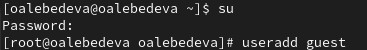
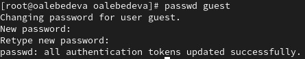
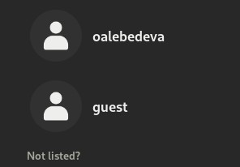
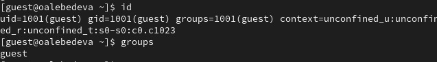
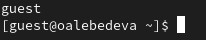
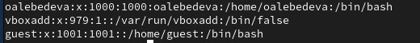
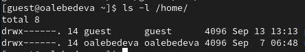
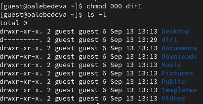

---
## Front matter
lang: ru-RU
title: "Лабораторная работа №2. Дискреционное разграничение прав в Linux. Основные атрибуты" 
subtitle: 
author: |
        Выполнила: Лебедева Ольга Андреевна
        \
        Преподаватель Кулябов Дмитрий Сергеевич д.ф.-м.н.,
        \ 
        профессор кафедры прикладной информатики и кибербезопасности
institute: |
           Российский университет дружбы народов, Москва, Россия
date: |
      2024

babel-lang: russian
babel-otherlangs: english
mainfont: Arial
monofont: Courier New
fontsize: 8pt

## Formatting
toc: false
slide_level: 2
theme: metropolis
header-includes: 
 - \metroset{progressbar=frametitle,sectionpage=progressbar,numbering=fraction}
 - '\makeatletter'
 - '\beamer@ignorenonframefalse'
 - '\makeatother'
aspectratio: 43
section-titles: true
---

## Цель работы

Получение практических навыков работы в консоли с атрибутами файлов, закрепление теоретических основ дискреционного разграничения доступа в современных системах с открытым кодом на базе ОС Linux[1].

## Теоретическое введение

Программа VirtualBox предоставляет широкий спектр возможностей для работы с виртуальными машинами. Это решение подходит для тестирования новых операционных систем, запуска старых приложений или изоляции потенциально опасного программного обеспечения. Благодаря интуитивно понятному интерфейсу и богатому функционалу, VirtualBox стал выбором многих пользователей по всему миру.

## Выполнение лабораторной работы

В установленной при выполнении предыдущей лабораторной работы
операционной системе создайте учётную запись пользователя guest: Cм. [рис. 1](#fig:001)

{ #fig:001 width=70% }

## Выполнение лабораторной работы

Задайте пароль для пользователя guest: Cм. [рис. 2](#fig:002)

{ #fig:002 width=70% }

## Выполнение лабораторной работы

Войдите в систему от имени пользователя guest: Cм. [рис. 3](#fig:003)

{ #fig:003 width=70% }

## Выполнение лабораторной работы

Определите директорию, в которой вы находитесь, командой pwd. Сравните её с приглашением командной строки. Определите, является ли она
вашей домашней директорией? Если нет, зайдите в домашнюю директорию:  Cм. [рис. 4](#fig:004). 

{ #fig:004 width=70% }

## Выполнение лабораторной работы

Чтобы перейти в домашнюю директорию, необходимо выполнить команду cd ..

Уточните имя вашего пользователя командой whoami: Cм. [рис. 5](#fig:005). 

{ #fig:005 width=70% }

## Выполнение лабораторной работы

Уточните имя вашего пользователя, его группу, а также группы, куда входит пользователь, командой id. Выведенные значения uid, gid и др. запомните. Сравните вывод id с выводом команды groups. Cм. [рис. 6](#fig:006).

{ #fig:006 width=70% }

## Выполнение лабораторной работы

Сравните полученную информацию об имени пользователя с данными,
выводимыми в приглашении командной строки: Cм. [рис. 7](#fig:007).

{ #fig:007 width=70% }

## Выполнение лабораторной работы

Просмотрите файл /etc/passwd командой cat /etc/passwd Найдите в нём свою учётную запись. Определите uid пользователя. Определите gid пользователя. Сравните найденные значения с полученными в предыдущих пунктах. Cм. [рис. 8](#fig:008).

{ #fig:008 width=70% }

## Выполнение лабораторной работы

Найдем свою учетную запись и сравним gid пользователя: Cм. [рис. 9](#fig:009).

{ #fig:009 width=70% }

## Выполнение лабораторной работы

Определите существующие в системе директории командой ls -l /home/ Удалось ли вам получить список поддиректорий директории /home? Какие права установлены на директориях? Есть все права у пользователя. Cм. [рис. 10](#fig:010).

{ #fig:010 width=70% }

## Выполнение лабораторной работы

Проверьте, какие расширенные атрибуты установлены на поддиректориях, находящихся в директории /home, командой: lsattr /home. Удалось ли вам увидеть расширенные атрибуты директории? Удалось ли вам увидеть расширенные атрибуты директорий других пользователей? ПОддиректорий нет. Cм. [рис. 11](#fig:011).

{ #fig:011 width=70% }

## Выполнение лабораторной работы

Создайте в домашней директории поддиректорию dir1 командой mkdir dir1. Определите командами ls -l и lsattr, какие права доступа и расширенные атрибуты были выставлены на директорию dir1: Cм. [рис. 12](#fig:012).
Для пользовател и групп все разрешения есть, для остальных изменения запрещены.

{ #fig:012 width=70% }

## Выполнение лабораторной работы

Снимите с директории dir1 все атрибуты командой chmod 000 dir1 и проверьте с её помощью правильность выполнения команды ls -l. Cм. [рис. 13](#fig:013).

{ #fig:013 width=70% }

## Выполнение лабораторной работы

Попытайтесь создать в директории dir1 файл file1 командой echo "test" > /home/guest/dir1/file1. Объясните, почему вы получили отказ в выполнении операции по созданию файла? Оцените, как сообщение об ошибке отразилось на создании файла? Проверьте командой ls -l /home/guest/dir1. Cм. [рис. 14](#fig:014). Создание файла произошло неудачно, т.к. нет прав на изменение.

{ #fig:014 width=70% }

## Заключение

Получили практические навыки работы в консоли с атрибутами файлов, закрепили теоретические основы дискреционного разграничения доступа в современных системах с открытым кодом на базе ОС Linux.

## Библиографическая справка 

[1] Документация по VirtualBox: https://www.virtualbox.org/