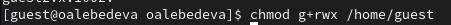

---
## Front matter
lang: ru-RU
title: "Лабораторная работа №3. Дискреционное разграничение прав в Linux. Два пользователя" 
subtitle: 
author: |
        Выполнила: Лебедева Ольга Андреевна
        \
        Преподаватель Кулябов Дмитрий Сергеевич д.ф.-м.н.,
        \ 
        профессор кафедры прикладной информатики и кибербезопасности
institute: |
           Российский университет дружбы народов, Москва, Россия
date: |
      2024

babel-lang: russian
babel-otherlangs: english
mainfont: Arial
monofont: Courier New
fontsize: 8pt

## Formatting
toc: false
slide_level: 2
theme: metropolis
header-includes: 
 - \metroset{progressbar=frametitle,sectionpage=progressbar,numbering=fraction}
 - '\makeatletter'
 - '\beamer@ignorenonframefalse'
 - '\makeatother'
aspectratio: 43
section-titles: true
---

## Цель работы

Получение практических навыков работы в консоли с атрибутами файлов для групп пользователей.

## Теоретическое введение

В Linux, как и в любой многопользовательской системе, естественным образом возникает задача разграничения доступа субъектов — пользователей к объектам — файлам дерева каталогов.

Один из подходов к разграничению доступа — так называемый дискреционный — предполагает назначение владельцев объектов, которые по собственному усмотрению определяют права доступа субъектов (других пользователей) к объектам (файлам), которыми владеют.

## Выполнение лабораторной работы

В установленной операционной системе создайте учётную запись пользователя guest.

Задайте пароль для пользователя guest.

Данные пункты были выполнены в лабораторных работах №1 и №2.

## Выполнение лабораторной работы

Аналогично создайте второго пользователя guest: Cм. [рис. 1](#fig:001)

{ #fig:001 width=70% }

## Выполнение лабораторной работы

Добавьте пользователя guest2 в группу guest: Cм. [рис. 2](#fig:002)

{ #fig:002 width=70% }

## Выполнение лабораторной работы

Осуществите вход в систему от двух пользователей на двух разных консолях: guest на первой консоли и guest2 на второй консоли.

Для обоих пользователей командой pwd определите директорию, в которой вы находитесь. Сравните её с приглашениями командной строки.

## Выполнение лабораторной работы

Уточните имя вашего пользователя, его группу, кто входит в неё и к каким группам принадлежит он сам. Определите командами groups guest и groups guest2, в какие группы входят пользователи guest и guest2. Сравните вывод команды groups с выводом команд id -Gn и id -G: Cм. [рис. 3](#fig:003)

{ #fig:003 width=70% }  

## Выполнение лабораторной работы

Сравните полученную информацию с содержимым файла /etc/group: Cм. [рис. 4](#fig:004). 

{ #fig:004 width=70% }

## Выполнение лабораторной работы

От имени пользователя guest2 выполните регистрацию пользователя guest2 в группе guest: Cм. [рис. 5](#fig:005). 

{ #fig:005 width=70% }

## Выполнение лабораторной работы

От имени пользователя guest измените права директории /home/guest, разрешив все действия для пользователей группы: Cм. [рис. 6](#fig:006).

{ #fig:006 width=70% }

## Выполнение лабораторной работы

От имени пользователя guest снимите с директории /home/guest/dir1 все атрибуты командой
chmod 000 dirl и проверьте правильность снятия атрибутов: Cм. [рис. 7](#fig:007).

{ #fig:007 width=70% }

## Заключение

Получили практические навыки работы в консоли с атрибутами файлов для групп пользователей.

## Библиографическая справка 

[1] Дискреционное разграничение доступа Linux: https://debianinstall.ru/diskretsionnoe-razgranichenie-dostupa-linux/