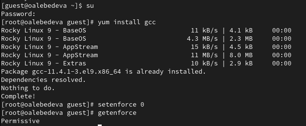
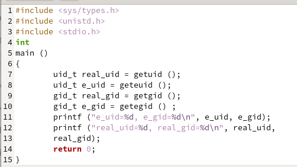
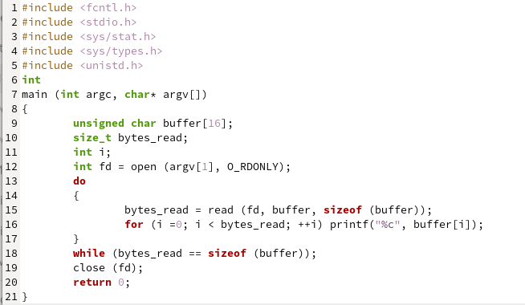
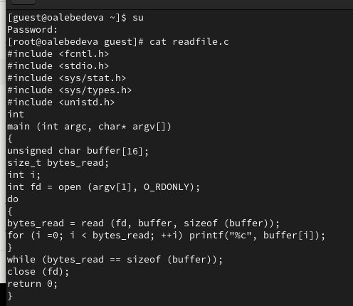
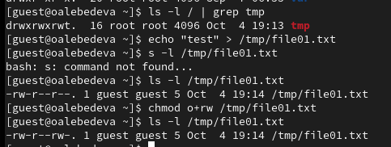

---
## Front matter
title: "Отчет по лабораторной работе №5"
subtitle: "Дискреционное разграничение прав в Linux. Исследование влияния дополнительных атрибутов"
author: "Лебедева Ольга Андреевна"

## Generic otions
lang: ru-RU
toc-title: "Содержание"

## Bibliography
bibliography: bib/cite.bib
csl: pandoc/csl/gost-r-7-0-5-2008-numeric.csl

## Pdf output format
toc: true # Table of contents
toc-depth: 2
lof: true # List of figures
#lot: true # List of tables
fontsize: 12pt
linestretch: 1.5
papersize: a4
documentclass: scrreprt
## I18n polyglossia
polyglossia-lang:
  name: russian
  options:
    - spelling=modern
    - babelshorthands=true
polyglossia-otherlangs:
  name: english
## I18n babel
babel-lang: russian
babel-otherlangs: english
## Fonts
mainfont: PT Serif
romanfont: PT Serif
sansfont: PT Sans
monofont: PT Mono
mainfontoptions: Ligatures=TeX
romanfontoptions: Ligatures=TeX
sansfontoptions: Ligatures=TeX,Scale=MatchLowercase
monofontoptions: Scale=MatchLowercase,Scale=0.9
## Biblatex
biblatex: true
biblio-style: "gost-numeric"
biblatexoptions:
  - parentracker=true
  - backend=biber
  - hyperref=auto
  - language=auto
  - autolang=other*
  - citestyle=gost-numeric
## Pandoc-crossref LaTeX customization
figureTitle: "Рис."
tableTitle: "Таблица"
listingTitle: "Листинг"
lofTitle: "Список иллюстраций"
lotTitle: "Список таблиц"
lolTitle: "Листинги"
## Misc options
indent: true
header-includes:
  - \usepackage{indentfirst}
  - \usepackage{float} # keep figures where there are in the text
  - \floatplacement{figure}{H} # keep figures where there are in the text
---

# Цель работы

Изучение механизмов изменения идентификаторов, применения SetUID- и Sticky-битов. Получение практических навыков работы в консоли с дополнительными атрибутами. Рассмотрение работы механизма смены идентификатора процессов пользователей, а также влияние бита Sticky на запись и удаление файлов.

# Теоретическое введение

В Linux существует три основных вида прав — право на чтение (read), запись (write) и выполнение (execute), а также три категории пользователей, к которым они могут применяться — владелец файла (user), группа владельца (group) и все остальные (others). Но, кроме прав чтения, выполнения и записи, есть еще три дополнительных атрибута.

Sticky bit используется в основном для каталогов, чтобы защитить в них файлы. В такой каталог может писать любой пользователь. Но, из такой директории пользователь может удалить только те файлы, владельцем которых он является. Примером может служить директория /tmp, в которой запись открыта для всех пользователей, но нежелательно удаление чужих файлов[1].

# Выполнение лабораторной работы

Подготовка лабороторного стенда. Устанавливаем gcc: Cм. [рис. 1](#fig:001)

{ #fig:001 width=70% }

1. Войдите в систему от имени пользователя guest.
2. Создайте программу simpleid.c:: Cм. [рис. 2](#fig:002)

{ #fig:002 width=70% }

3. Скомплилируйте программу и убедитесь, что файл программы создан:
gcc simpleid.c -o simpleid
4. Выполните программу simpleid:
5. Выполните системную программу id, и сравните полученный вами результат с данными предыдущего пункта
задания.: Cм. [рис. 3](#fig:003)

{ #fig:003 width=70% }

6. Усложните программу, добавив вывод действительных идентификаторов: Cм. [рис. 4](#fig:004)

{ #fig:004 width=70% }

Получившуюся программу назовите simpleid2.c.

7. Скомпилируйте и запустите simpleid2.c:
gcc simpleid2.c -o simpleid2
./simpleid2: Cм. [рис. 5](#fig:005)

{ #fig:005 width=70% }

8. От имени суперпользователя выполните команды.
9. Используйте sudo или повысьте временно свои права с помощью su. Поясните, что делают эти команды.
10. Выполните проверку правильности установки новых атрибутов и смены владельца файла simpleid2.
11. Запустите simpleid2 и id. Сравните результаты: Cм. [рис. 6](#fig:006)

{ #fig:006 width=70% }

Проделайте тоже самое относительно SetGID-бита: Cм. [рис. 7](#fig:007) 

{ #fig:007 width=70% }

Создайте программу readfile.c: Cм. [рис. 8](#fig:008)

{ #fig:008 width=70% }

14. Откомпилируйте её: Cм. [рис. 9](#fig:009)

{ #fig:009 width=70% }

15. Смените владельца у файла readfile.c (или любого другого текстового файла в системе) и измените права так, чтобы только суперпользователь (root) мог прочитать его, a guest не мог: Cм. [рис. 10](#fig:010)

{ #fig:010 width=70% }

16. Проверьте, что пользователь guest не может прочитать файл readfile.c.
17. Смените у программы readfile владельца и установите SetU’D-бит.
18. Проверьте, может ли программа readfile прочитать файл readfile.c?
19. Проверьте, может ли программа readfile прочитать файл /etc/shadow? Cм. [рис. 11](#fig:011)

{ #fig:011 width=70% }

Пробуем все шаги выполнить от имени суперпользователя: Cм. [рис. 12](#fig:012), Cм. [рис. 13](#fig:013)

{ #fig:012 width=70% }

{ #fig:013 width=70% }

1. Выясните, установлен ли атрибут Sticky на директории /tmp.
2. От имени пользователя guest создайте файл file01.txt в директории /tmp со словом test.
3. Просмотрите атрибуты у только что созданного файла и разрешите чтение и запись для категории пользователей «все остальные».
4. От пользователя guest2 (не являющегося владельцем) попробуйте прочитать файл /tmp/file01.txt.
5. От пользователя guest2 попробуйте дозаписать в файл.
Удалось ли вам выполнить операцию? Нет.
6. Проверьте содержимое файла.
7. От пользователя guest2 попробуйте записать в файл /tmp/file01.txt
слово test3, стерев при этом всю имеющуюся в файле информацию.
Удалось ли вам выполнить операцию? Нет.
8. Проверьте содержимое файла командой
cat /tmp/file01.txt
9. От пользователя guest2 попробуйте удалить файл /tmp/file01.txt.
Удалось ли вам удалить файл? Нет.
10. Повысьте свои права до суперпользователя следующей командой su и выполните после этого команду, снимающую атрибут t (Sticky-бит) с директории /tmp.
11. Покиньте режим суперпользователя командой.
12. От пользователя guest2 проверьте, что атрибута t у директории /tmp
нет.
13. Повторите предыдущие шаги. Какие наблюдаются изменения?

При повторении всё получилось.

14. Удалось ли вам удалить файл от имени пользователя, не являющегося его владельцем? Удалось. Cм. [рис. 14](#fig:014), 

{ #fig:014 width=70% }

15. Повысьте свои права до суперпользователя и верните атрибут t на директорию /tmp: Cм. [рис. 15](#fig:015)

{ #fig:015 width=70% }

# Заключение

Изучили механизмы изменения идентификаторов, применения SetUID- и Sticky-битов. Получили практические навыки работы в консоли с дополнительными атрибутами. Рассмотрели работу механизма смены идентификатора процессов пользователей, а также влияние бита Sticky на запись и удаление файлов.

# Библиографическая справка 

[1] Дополнительные атрибуты файлов: https://tokmakov.msk.ru/blog/item/141

