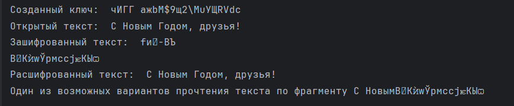

---
## Front matter
lang: ru-RU
title: "Лабораторная работа №7. Элементы криптографии. Однократное гаммирование" 
subtitle: 
author: |
        Выполнила: Лебедева Ольга Андреевна
        \
        Преподаватель Кулябов Дмитрий Сергеевич д.ф.-м.н.,
        \ 
        профессор кафедры прикладной информатики и кибербезопасности
institute: |
           Российский университет дружбы народов, Москва, Россия
date: |
      2024

babel-lang: russian
babel-otherlangs: english
mainfont: Arial
monofont: Courier New
fontsize: 8pt

## Formatting
toc: false
slide_level: 2
theme: metropolis
header-includes: 
 - \metroset{progressbar=frametitle,sectionpage=progressbar,numbering=fraction}
 - '\makeatletter'
 - '\beamer@ignorenonframefalse'
 - '\makeatother'
aspectratio: 43
section-titles: true
---

## Цель работы

Освоить на практике применение режима однократного гаммирования.

## Теоретическое введение

Гаммирование представляет собой наложение (снятие) на открытые (зашифрованные) данные последовательности элементов других данных, полученной с помощью некоторого криптографического алгоритма, для получения зашифрованных (открытых) данных. Иными словами, наложение
гаммы — это сложение её элементов с элементами открытого (закрытого) текста по некоторому фиксированному модулю, значение которого представляет собой известную часть алгоритма шифрования.

Наложение гаммы по сути представляет собой выполнение операции сложения по модулю 2 (XOR) (обозначаемая знаком ⊕) между элементами гаммы и элементами подлежащего сокрытию текста[1].

## Задание лабораторной работы

Нужно подобрать ключ, чтобы получить сообщение «С Новым Годом,
друзья!». Требуется разработать приложение, позволяющее шифровать и дешифровать данные в режиме однократного гаммирования. Приложение должно:
1. Определить вид шифротекста при известном ключе и известном открытом тексте.
2. Определить ключ, с помощью которого шифротекст может быть преобразован в некоторый фрагмент текста, представляющий собой один из
возможных вариантов прочтения открытого текста.

## Выполнение лабораторной работы

Код лабораторной работы:

    import random

    def generate_random_key(text):
        possible_symbol = list(range(32, 127)) + list(range(1040, 1104))
        key_str = ''.join(chr(random.choice(possible_symbol)) for _ in range(len(text)))
        return key_str

    def xor(text, key):
        return [ord(s1) ^ ord(s2) for s1, s2 in zip(text, key)]

## Выполнение лабораторной работы        

    def encrypt(text, key):
        chiphr = xor(text, key)
        chiphrotext = ''.join(chr(i) for i in chiphr)
        return chiphrotext

    def decrypt(chiphro, key):
        decrypted = xor(chiphro, key)
        opentext = ''.join(chr(i) for i in decrypted)
        return opentext

## Выполнение лабораторной работы

    def find_key(chiphrotext, text_fragment):
        chipher_fragment = chiphrotext[:(len(chiphrotext))]
        key_f = xor(text_fragment, chipher_fragment)
        found_key = ''.join(chr(i) for i in key_f)
        return found_key

    text = "С Новым Годом, друзья!"
    text_fragment = "С Новым"
    key = generate_random_key(text)
    print("Созданный ключ: ", key)
    chiphrotext = encrypt(text, key)
    print('Открытый текст: ', text)

## Выполнение лабораторной работы

    print('Зашифрованный текст: ', chiphrotext)
    opentext = decrypt(chiphrotext, key)
    print('Расшифрованный текст: ', opentext)
    found_key = find_key(chiphrotext, text_fragment)
    open_fragtext = decrypt(chiphrotext[:len(text_fragment)], found_key)
    print('Один из возможных вариантов прочтения текста по фрагменту', open_fragtext + chiphrotext[len(text_fragment):])

## Выполнение лабораторной работы

Эта программа реализует шифрование и дешифрование текста с использованием симметричного шифра на основе операции XOR. Сначала генерируется случайный ключ той же длины, что и исходный текст, выбирая случайные символы из определенного диапазона (включая латинские и кириллические символы). Затем текст шифруется с использованием операции XOR между символами исходного текста и ключа, что приводит к зашифрованному тексту. Дешифрование осуществляется аналогично: выполняется обратная операция XOR между зашифрованным текстом и ключом, что позволяет восстановить исходный текст. Дополнительно программа включает функцию для нахождения ключа по фрагменту исходного текста и соответствующему фрагменту зашифрованного текста, что демонстрирует возможность частичной дешифровки текста.

## Выполнение лабораторной работы

Результат работы кода: Cм. [рис. 1](#fig:001)

{ #fig:001 width=70% }

## Заключение

Освоили  на практике применение режима однократного гаммирования.

## Библиографическая справка 

[1] Гаммирование: https://www.researchgate.net/profile/Dmitry-Kulyabov/publication/339290917_Informacionnaa_bezopasnost_komputernyh_setej_laboratornye_raboty/links/5e482028299bf1cdb92e26d4/Informacionnaa-bezopasnost-komputernyh-setej-laboratornye-raboty.pdf

