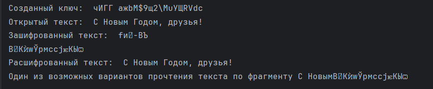

---
## Front matter
title: "Лабораторная работа №7"
subtitle: "Элементы криптографии. Однократное гаммирование"
author: "Лебедева Ольга Андреевна"

## Generic otions
lang: ru-RU
toc-title: "Содержание"

## Bibliography
bibliography: bib/cite.bib
csl: pandoc/csl/gost-r-7-0-5-2008-numeric.csl

## Pdf output format
toc: true # Table of contents
toc-depth: 2
lof: true # List of figures
#lot: true # List of tables
fontsize: 12pt
linestretch: 1.5
papersize: a4
documentclass: scrreprt
## I18n polyglossia
polyglossia-lang:
  name: russian
  options:
    - spelling=modern
    - babelshorthands=true
polyglossia-otherlangs:
  name: english
## I18n babel
babel-lang: russian
babel-otherlangs: english
## Fonts
mainfont: PT Serif
romanfont: PT Serif
sansfont: PT Sans
monofont: PT Mono
mainfontoptions: Ligatures=TeX
romanfontoptions: Ligatures=TeX
sansfontoptions: Ligatures=TeX,Scale=MatchLowercase
monofontoptions: Scale=MatchLowercase,Scale=0.9
## Biblatex
biblatex: true
biblio-style: "gost-numeric"
biblatexoptions:
  - parentracker=true
  - backend=biber
  - hyperref=auto
  - language=auto
  - autolang=other*
  - citestyle=gost-numeric
## Pandoc-crossref LaTeX customization
figureTitle: "Рис."
tableTitle: "Таблица"
listingTitle: "Листинг"
lofTitle: "Список иллюстраций"
lotTitle: "Список таблиц"
lolTitle: "Листинги"
## Misc options
indent: true
header-includes:
  - \usepackage{indentfirst}
  - \usepackage{float} # keep figures where there are in the text
  - \floatplacement{figure}{H} # keep figures where there are in the text
---

# Цель работы

Освоить на практике применение режима однократного гаммирования.

# Теоретическое введение

Гаммирование представляет собой наложение (снятие) на открытые (зашифрованные) данные последовательности элементов других данных, полученной с помощью некоторого криптографического алгоритма, для получения зашифрованных (открытых) данных. Иными словами, наложение
гаммы — это сложение её элементов с элементами открытого (закрытого) текста по некоторому фиксированному модулю, значение которого представляет собой известную часть алгоритма шифрования.

Наложение гаммы по сути представляет собой выполнение операции сложения по модулю 2 (XOR) (обозначаемая знаком ⊕) между элементами гаммы и элементами подлежащего сокрытию текста[1].

# Задание лабораторной работы

Нужно подобрать ключ, чтобы получить сообщение «С Новым Годом,
друзья!». Требуется разработать приложение, позволяющее шифровать и дешифровать данные в режиме однократного гаммирования. Приложение должно:
1. Определить вид шифротекста при известном ключе и известном открытом тексте.
2. Определить ключ, с помощью которого шифротекст может быть преобразован в некоторый фрагмент текста, представляющий собой один из
возможных вариантов прочтения открытого текста.

# Выполнение лабораторной работы

Код лабораторной работы:

    import random

    def generate_random_key(text):
        possible_symbol = list(range(32, 127)) + list(range(1040, 1104))
        key_str = ''.join(chr(random.choice(possible_symbol)) for _ in range(len(text)))
        return key_str

    def xor(text, key):
        return [ord(s1) ^ ord(s2) for s1, s2 in zip(text, key)]

    def encrypt(text, key):
        chiphr = xor(text, key)
        chiphrotext = ''.join(chr(i) for i in chiphr)
        return chiphrotext

    def decrypt(chiphro, key):
        decrypted = xor(chiphro, key)
        opentext = ''.join(chr(i) for i in decrypted)
        return opentext

    def find_key(chiphrotext, text_fragment):
        chipher_fragment = chiphrotext[:(len(chiphrotext))]
        key_f = xor(text_fragment, chipher_fragment)
        found_key = ''.join(chr(i) for i in key_f)
        return found_key

    text = "С Новым Годом, друзья!"
    text_fragment = "С Новым"
    key = generate_random_key(text)
    print("Созданный ключ: ", key)
    chiphrotext = encrypt(text, key)
    print('Открытый текст: ', text)
    print('Зашифрованный текст: ', chiphrotext)
    opentext = decrypt(chiphrotext, key)
    print('Расшифрованный текст: ', opentext)
    found_key = find_key(chiphrotext, text_fragment)
    open_fragtext = decrypt(chiphrotext[:len(text_fragment)], found_key)
    print('Один из возможных вариантов прочтения текста по фрагменту', open_fragtext + chiphrotext[len(text_fragment):])

Эта программа реализует шифрование и дешифрование текста с использованием симметричного шифра на основе операции XOR. Сначала генерируется случайный ключ той же длины, что и исходный текст, выбирая случайные символы из определенного диапазона (включая латинские и кириллические символы). Затем текст шифруется с использованием операции XOR между символами исходного текста и ключа, что приводит к зашифрованному тексту. Дешифрование осуществляется аналогично: выполняется обратная операция XOR между зашифрованным текстом и ключом, что позволяет восстановить исходный текст. Дополнительно программа включает функцию для нахождения ключа по фрагменту исходного текста и соответствующему фрагменту зашифрованного текста, что демонстрирует возможность частичной дешифровки текста.

Результат работы кода: Cм. [рис. 1](#fig:001)

{ #fig:001 width=70% }

# Заключение

Освоили  на практике применение режима однократного гаммирования.

# Ответы на вопросы

1. Поясните смысл однократного гаммирования.

Однократное гаммирование — это метод симметричного шифрования, который заключается в наложении случайной последовательности (гаммы) на открытый текст с целью получения шифротекста. Гамма должна быть такой же длины, как и открытый текст, и используется только один раз для каждого сообщения. Этот метод обеспечивает высокий уровень безопасности, так как при правильном использовании он является невскрываемым, что означает, что даже если часть шифротекста будет известна, это не даст информации о других частях

2. Перечислите недостатки однократного гаммирования.

Необходимость в длинной гамме: Для каждого сообщения требуется новая гамма той же длины, что и открытый текст, что делает процесс обмена ключами сложным и неудобным.

Сложность генерации случайных чисел: Генерация качественной гаммы требует использования аппаратных генераторов случайных чисел, что может быть затруднительно.

Уязвимость при повторном использовании гаммы: Если гамма будет использована повторно, это приведет к возможности криптоанализа

3. Перечислите преимущества однократного гаммирования.

Абсолютная стойкость: При соблюдении условий (гамма случайна и используется только один раз) шифр является абсолютно стойким согласно теории Шеннона.

Простота реализации: Шифрование и дешифрование выполняются одной и той же операцией (XOR), что упрощает реализацию алгоритма.

Отсутствие зависимости от структуры данных: Метод не зависит от частотного анализа текста, так как гамма полностью случайна.

4. Почему длина открытого текста должна совпадать с длиной ключа?

Длина открытого текста должна совпадать с длиной ключа (гаммы), чтобы каждый бит открытого текста мог быть зашифрован соответствующим битом гаммы. Это обеспечивает полное наложение и делает невозможным восстановление информации без полного доступа к гамме

5. Какая операция используется в режиме однократного гаммирования, назовите её особенности?

В режиме однократного гаммирования используется операция исключающего ИЛИ (XOR). Эта операция имеет следующие особенности:

- Она является симметричной
- Позволяет легко восстанавливать исходные данные при наличии ключа.

6. Как по открытому тексту и ключу получить шифротекст?

Шифротекст можно получить с помощью операции XOR между открытым текстом и ключом.

7. Как по открытому тексту и шифротексту получить ключ?

Ключ можно восстановить по битам шифротекста и открытого текста с помощью XOR.

8. В чем заключаются необходимые и достаточные условия абсолютной стойкости шифра?

- Гамма должна быть случайной и независимой от открытого текста.
- Длина гаммы должна быть не меньше длины защищаемого сообщения.
- Гамма должна использоваться только один раз для каждого сообщения.

# Библиографическая справка 

[1] Гаммирование: https://www.researchgate.net/profile/Dmitry-Kulyabov/publication/339290917_Informacionnaa_bezopasnost_komputernyh_setej_laboratornye_raboty/links/5e482028299bf1cdb92e26d4/Informacionnaa-bezopasnost-komputernyh-setej-laboratornye-raboty.pdf

