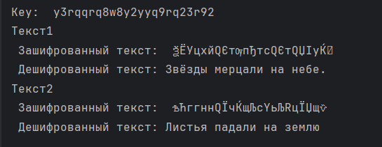

---
## Front matter
title: "Лабораторная работа №8"
subtitle: "Элементы криптографии. Шифрование (кодирование) различных исходных текстов одним ключом"
author: "Лебедева Ольга Андреевна"

## Generic otions
lang: ru-RU
toc-title: "Содержание"

## Bibliography
bibliography: bib/cite.bib
csl: pandoc/csl/gost-r-7-0-5-2008-numeric.csl

## Pdf output format
toc: true # Table of contents
toc-depth: 2
lof: true # List of figures
#lot: true # List of tables
fontsize: 12pt
linestretch: 1.5
papersize: a4
documentclass: scrreprt
## I18n polyglossia
polyglossia-lang:
  name: russian
  options:
    - spelling=modern
    - babelshorthands=true
polyglossia-otherlangs:
  name: english
## I18n babel
babel-lang: russian
babel-otherlangs: english
## Fonts
mainfont: PT Serif
romanfont: PT Serif
sansfont: PT Sans
monofont: PT Mono
mainfontoptions: Ligatures=TeX
romanfontoptions: Ligatures=TeX
sansfontoptions: Ligatures=TeX,Scale=MatchLowercase
monofontoptions: Scale=MatchLowercase,Scale=0.9
## Biblatex
biblatex: true
biblio-style: "gost-numeric"
biblatexoptions:
  - parentracker=true
  - backend=biber
  - hyperref=auto
  - language=auto
  - autolang=other*
  - citestyle=gost-numeric
## Pandoc-crossref LaTeX customization
figureTitle: "Рис."
tableTitle: "Таблица"
listingTitle: "Листинг"
lofTitle: "Список иллюстраций"
lotTitle: "Список таблиц"
lolTitle: "Листинги"
## Misc options
indent: true
header-includes:
  - \usepackage{indentfirst}
  - \usepackage{float} # keep figures where there are in the text
  - \floatplacement{figure}{H} # keep figures where there are in the text
---

# Цель работы

Освоить на практике применение режима однократного гаммирования на примере кодирования различных исходных текстов одним ключом.

# Теоретическое введение

Гаммирование представляет собой наложение (снятие) на открытые (зашифрованные) данные последовательности элементов других данных, полученной с помощью некоторого криптографического алгоритма, для получения зашифрованных (открытых) данных. Иными словами, наложение
гаммы — это сложение её элементов с элементами открытого (закрытого) текста по некоторому фиксированному модулю, значение которого представляет собой известную часть алгоритма шифрования.

Наложение гаммы по сути представляет собой выполнение операции сложения по модулю 2 (XOR) (обозначаемая знаком ⊕) между элементами гаммы и элементами подлежащего сокрытию текста[1].

# Задание лабораторной работы

Два текста кодируются одним ключом (однократное гаммирование).
Требуется не зная ключа и не стремясь его определить, прочитать оба текста. Необходимо разработать приложение, позволяющее шифровать и дешифровать тексты P1 и P2 в режиме однократного гаммирования. Приложение должно определить вид шифротекстов C1 и C2 обоих текстов P1 и P2 при известном ключе ; Необходимо определить и выразить аналитически способ, при котором злоумышленник может прочитать оба текста, не зная ключа и не стремясь его определить.

# Выполнение лабораторной работы

Код лабораторной работы:

    import random

    def generate_key(word):
        key = ""
        for _ in range(len(word)):
            key += random.choice("qwerty1234567890")
        return key

    def en_de_crypt(text, key):
        next_text = ""
        for i in range(len(text)):
            next_text += chr(ord(text[i])^ord(key[i%len(key)]))
        return next_text

    TEXT1 = 'Звёзды мерцали на небе.'
    TEXT2 = 'Листья падали на землю'

    key = generate_key(TEXT1)
    en_TEXT1 = en_de_crypt(TEXT1, key)
    de_TEXT1 = en_de_crypt(en_TEXT1, key)
    en_TEXT2 = en_de_crypt(TEXT2, key)
    de_TEXT2 = en_de_crypt(en_TEXT2, key)

    print("Key: ", key)
    print("Текст1", "\n Зашифрованный текст: ", en_TEXT1, "\n Дешифрованный текст:", de_TEXT1)
    print("Текст2", "\n Зашифрованный текст: ", en_TEXT2, "\n Дешифрованный текст:", de_TEXT2)

В этом коде мы сначала написали функцию для генерации рандомного ключа. После добавили функцию шифрованния и дешифрования, основанную на алгоритме XOR. Задали два предлодения одинаковой длины. Далее, использовали один ключ для шифрования и дешифрования обих предложений. Вывели результаты в консоль. 

Результат работы кода: Cм. [рис. 1](#fig:001)

{ #fig:001 width=70% }

# Аналитическое решение:

1. Пусть тексты `P1` и `P2` шифруются с использованием одного ключа `K` при помощи операции XOR:
   `C1 = P1 ⊕ K`
   `C2 = P2 ⊕ K`

2. Если злоумышленник перехватил оба зашифрованных текста `C1` и `C2`, он может воспользоваться тем, что:
   `C1 ⊕ C2 = (P1 ⊕ K) ⊕ (P2 ⊕ K) = P1 ⊕ P2`
   Это выражение убирает влияние ключа `K` и возвращает результат `P1 ⊕ P2`, который представляет собой XOR между двумя открытыми текстами.

3. Зная `P1 ⊕ P2`, злоумышленник может воспользоваться информацией о возможных шаблонах в текстах, частотных характеристиках языка или общих конструкциях предложений. Например, если один из текстов (например, `P1`) известен или может быть угадан (например, если это стандартный заголовок или часто встречающаяся фраза), то можно вычислить другой текст `P2`:
   `P2 = (P1 ⊕ P2) ⊕ P1`

4. В результате, без необходимости восстанавливать ключ `K`, злоумышленник может восстановить оба текста, используя операцию XOR для двух зашифрованных текстов.

Повторное использование одного ключа для шифрования нескольких сообщений делает систему уязвимой к атаке через анализ XOR зашифрованных текстов. Это является одной из причин, почему однократные блокноты (одноразовые гаммы) должны использоваться только один раз для каждого сообщения.

# Заключение

Освоили на практике применение режима однократного гаммирования на примере кодирования различных исходных текстов одним ключом.

# Ответы на вопросы

1. **Как, зная один из текстов (P1 или P2), определить другой, не зная при этом ключа?**

   Если известен один из открытых текстов (например, P1), и оба текста зашифрованы с использованием одного и того же ключа, то можно воспользоваться тем, что операция XOR двух зашифрованных текстов (C1 и C2) отменяет влияние ключа. Вычислив `C1 ⊕ C2 = P1 ⊕ P2`, можно найти разницу между P1 и P2. Зная P1, можно восстановить P2 через `P2 = (P1 ⊕ P2) ⊕ P1`.

2. **Что будет при повторном использовании ключа при шифровании текста?**

   Повторное использование одного и того же ключа (особенно в одноразовом блокноте или гаммировании) приводит к ослаблению криптографической безопасности. Зная два зашифрованных текста, можно определить их разницу (как указано выше) и, соответственно, легче восстановить исходные сообщения, особенно при наличии дополнительных данных о структуре сообщений.

3. **Как реализуется режим шифрования однократного гаммирования одним ключом двух открытых текстов?**

   Однократное гаммирование реализуется с использованием одной и той же гаммы (ключа) для обоих текстов. Это делается следующим образом:
   `C1 = P1 ⊕ K`
   `C2 = P2 ⊕ K`
   Где `P1` и `P2` — два открытых текста, `K` — ключ (гамма), и `C1`, `C2` — зашифрованные тексты. Как только ключ `K` используется для шифрования нескольких текстов, гамма перестает быть одноразовой, что приводит к уязвимостям.

4. **Перечислите недостатки шифрования одним ключом двух открытых текстов.**

   - Уязвимость к криптоаналитическим атакам, поскольку можно вычислить разность между двумя текстами через `C1 ⊕ C2 = P1 ⊕ P2`, что упрощает восстановление одного текста, зная другой.
   - Потеря уникальности ключа: одноразовый блокнот становится небезопасным, когда ключ используется повторно.
   - Повышенная вероятность угадывания содержимого, если известно что-то о структуре или шаблонах в открытых текстах (например, формат сообщений, стандартные заголовки).

5. **Перечислите преимущества шифрования одним ключом двух открытых текстов.**

   - Сниженная сложность управления ключами, так как требуется только один ключ для шифрования нескольких сообщений.
   - Упрощенная реализация шифрования, так как не нужно генерировать уникальный ключ для каждого текста.
   - При небольших объемах данных и коротких сообщениях может показаться удобным повторное использование ключа, особенно если это не сопровождается критически важными последствиями для безопасности.

# Библиографическая справка 

[1] Гаммирование: https://www.researchgate.net/profile/Dmitry-Kulyabov/publication/339290917_Informacionnaa_bezopasnost_komputernyh_setej_laboratornye_raboty/links/5e482028299bf1cdb92e26d4/Informacionnaa-bezopasnost-komputernyh-setej-laboratornye-raboty.pdf

