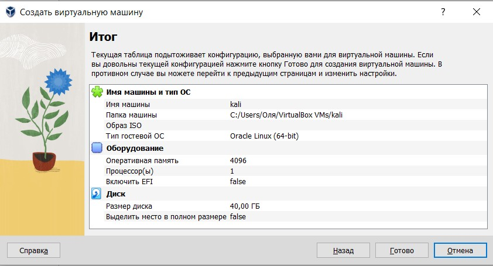
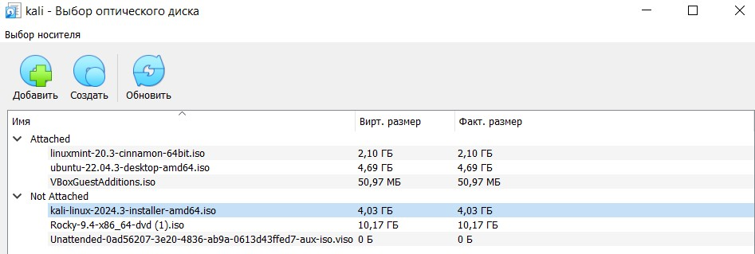
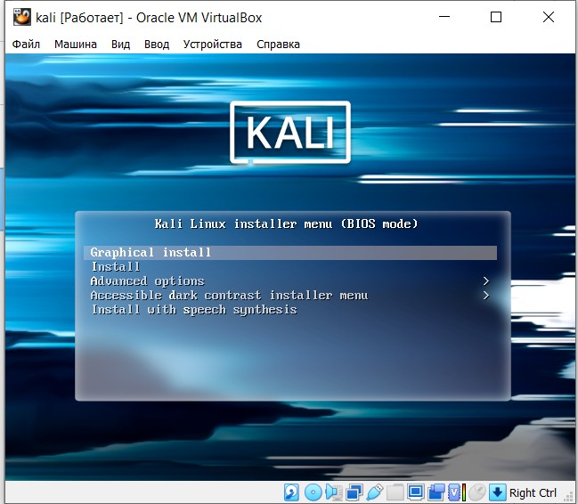
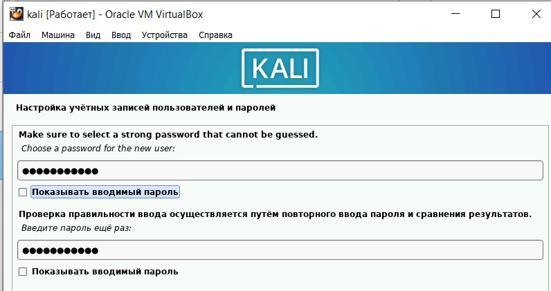
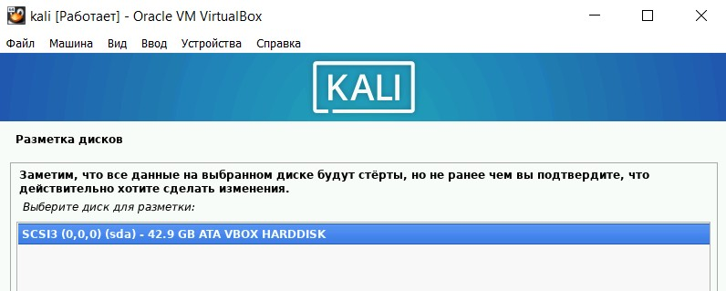
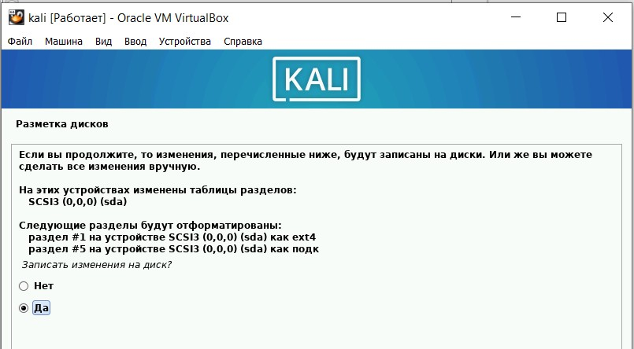
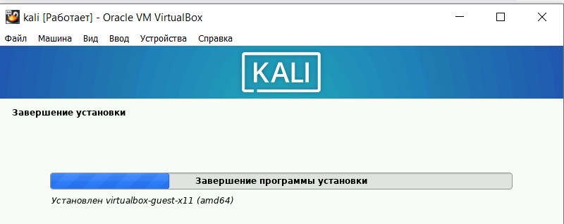
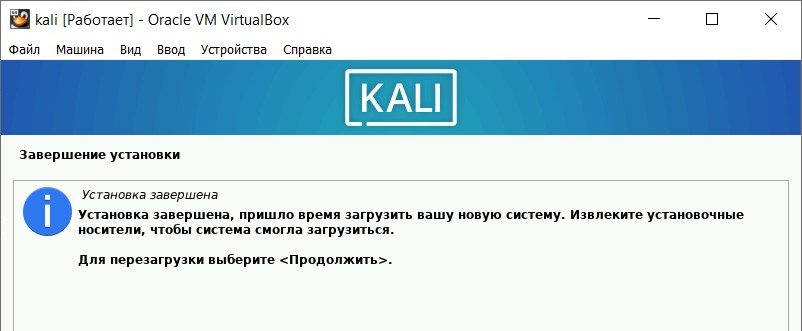
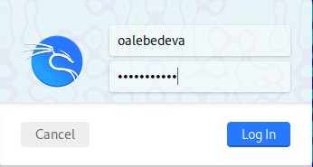
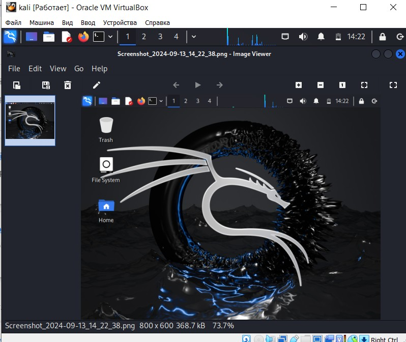

---
## Front matter
lang: ru-RU
title: "Отчет по индивидуальному проекту. Этап 1" 
subtitle: 
author: |
        Выполнила: Лебедева Ольга Андреевна
        \
        Преподаватель Кулябов Дмитрий Сергеевич д.ф.-м.н.,
        \ 
        профессор кафедры прикладной информатики и кибербезопасности
institute: |
           Российский университет дружбы народов, Москва, Россия
date: |
      2024

babel-lang: russian
babel-otherlangs: english
mainfont: Arial
monofont: Courier New
fontsize: 8pt

## Formatting
toc: false
slide_level: 2
theme: metropolis
header-includes: 
 - \metroset{progressbar=frametitle,sectionpage=progressbar,numbering=fraction}
 - '\makeatletter'
 - '\beamer@ignorenonframefalse'
 - '\makeatother'
aspectratio: 43
section-titles: true
---

## Цель работы

Целью данной работы является установка дистрибутива Kali на виртуальную машину.

## Теоретическое введение

Программа VirtualBox предоставляет широкий спектр возможностей для работы с виртуальными машинами. Это решение подходит для тестирования новых операционных систем, запуска старых приложений или изоляции потенциально опасного программного обеспечения. Благодаря интуитивно понятному интерфейсу и богатому функционалу, VirtualBox стал выбором многих пользователей по всему миру[1].

## Выполнение лабораторной работы

Запускаем виртуальную машину, нажимаем кнопку "создать": Cм. [рис. 1](#fig:001)

{ #fig:001 width=70% }

## Выполнение лабораторной работы

Задаём настройки оборудования ОС: Cм. [рис. 2](#fig:002)

{ #fig:002 width=70% }

## Выполнение лабораторной работы

Создаём новый виртуальный жёсткий диск размером 40 Гб: Cм. [рис. 3](#fig:003)

{ #fig:003 width=70% }

## Выполнение лабораторной работы

Проверям итоговую конфигурацию для виртуальной машины: Cм. [рис. 4](#fig:004)

{ #fig:004 width=70% }

## Выполнение лабораторной работы

Меняем контроллер на скаченный образ Rocky: Cм. [рис. 5](#fig:005)

{ #fig:005 width=70% }

## Выполнение лабораторной работы

Приступим к найстройке графики: Cм. [рис. 6](#fig:006)

{ #fig:006 width=70% }

## Выполнение лабораторной работы

Попадаем в стартовое меню установки, выбираем русский язык: Cм. [рис. 7](#fig:007), Cм. [рис. 8](#fig:008)

{ #fig:007 width=70% }

## Выполнение лабораторной работы

{ #fig:008 width=70% }

## Выполнение лабораторной работы

Вводим имя компьютера: Cм. [рис. 9](#fig:009)

{ #fig:009 width=70% }

## Выполнение лабораторной работы

Настраиваем имя пользователя: Cм. [рис. 10](#fig:010)

{ #fig:010 width=70% }

## Выполнение лабораторной работы

Настраиваем пароль: Cм. [рис. 11](#fig:011)

{ #fig:011 width=70% }

## Выполнение лабораторной работы

Выбираем разметку дисков: Cм. [рис. 12](#fig:012), Cм. [рис. 13](#fig:013), Cм. [рис. 14](#fig:014), Cм. [рис. 15](#fig:015), Cм. [рис. 16](#fig:016)

{ #fig:012 width=70% }

## Выполнение лабораторной работы

{ #fig:013 width=70% }

## Выполнение лабораторной работы

{ #fig:014 width=70% }

## Выполнение лабораторной работы

{ #fig:015 width=70% }

## Выполнение лабораторной работы

{ #fig:016 width=70% }

## Выполнение лабораторной работы

Запускаем установку базовой системы: Cм. [рис. 17](#fig:017)

{ #fig:017 width=70% }

## Выполнение лабораторной работы

Выбираем ПО: Cм. [рис. 18](#fig:018)

{ #fig:018 width=70% }

## Выполнение лабораторной работы

Запускаем завершение установки: Cм. [рис. 19](#fig:019), Cм. [рис. 20](#fig:020)

{ #fig:019 width=70% }

## Выполнение лабораторной работы

{ #fig:020 width=70% }

## Выполнение лабораторной работы

Заходим в созданную учетную запись: См. [рис. 21](#fig:021)

{ #fig:021 width=70% }

## Выполнение лабораторной работы

Видим графический интерфейс и на этом завершаем процесс уставки дистрибутива: См. [рис. 22](#fig:022)

{ #fig:022 width=70% }

## Заключение

Установили дистрибутив Kali на виртуальную машину.

## Библиографическая справка 

[1] Документация по VirtualBox: https://www.virtualbox.org/

