---
## Front matter
title: "Отчет по индивидуальному проекту"
subtitle: "Этап 1"
author: "Лебедева Ольга Андреевна"

## Generic otions
lang: ru-RU
toc-title: "Содержание"

## Bibliography
bibliography: bib/cite.bib
csl: pandoc/csl/gost-r-7-0-5-2008-numeric.csl

## Pdf output format
toc: true # Table of contents
toc-depth: 2
lof: true # List of figures
#lot: true # List of tables
fontsize: 12pt
linestretch: 1.5
papersize: a4
documentclass: scrreprt
## I18n polyglossia
polyglossia-lang:
  name: russian
  options:
    - spelling=modern
    - babelshorthands=true
polyglossia-otherlangs:
  name: english
## I18n babel
babel-lang: russian
babel-otherlangs: english
## Fonts
mainfont: PT Serif
romanfont: PT Serif
sansfont: PT Sans
monofont: PT Mono
mainfontoptions: Ligatures=TeX
romanfontoptions: Ligatures=TeX
sansfontoptions: Ligatures=TeX,Scale=MatchLowercase
monofontoptions: Scale=MatchLowercase,Scale=0.9
## Biblatex
biblatex: true
biblio-style: "gost-numeric"
biblatexoptions:
  - parentracker=true
  - backend=biber
  - hyperref=auto
  - language=auto
  - autolang=other*
  - citestyle=gost-numeric
## Pandoc-crossref LaTeX customization
figureTitle: "Рис."
tableTitle: "Таблица"
listingTitle: "Листинг"
lofTitle: "Список иллюстраций"
lotTitle: "Список таблиц"
lolTitle: "Листинги"
## Misc options
indent: true
header-includes:
  - \usepackage{indentfirst}
  - \usepackage{float} # keep figures where there are in the text
  - \floatplacement{figure}{H} # keep figures where there are in the text
---

# Цель работы

Целью данной работы является установка дистрибутива Kali на виртуальную машину.

# Теоретическое введение

Программа VirtualBox предоставляет широкий спектр возможностей для работы с виртуальными машинами. Это решение подходит для тестирования новых операционных систем, запуска старых приложений или изоляции потенциально опасного программного обеспечения. Благодаря интуитивно понятному интерфейсу и богатому функционалу, VirtualBox стал выбором многих пользователей по всему миру[1].

# Выполнение лабораторной работы

Запускаем виртуальную машину, нажимаем кнопку "создать": Cм. [рис. 1](#fig:001)

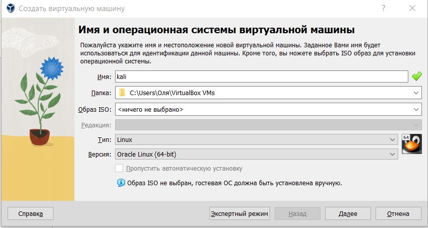{ #fig:001 width=70% }

Задаём настройки оборудования ОС: Cм. [рис. 2](#fig:002)

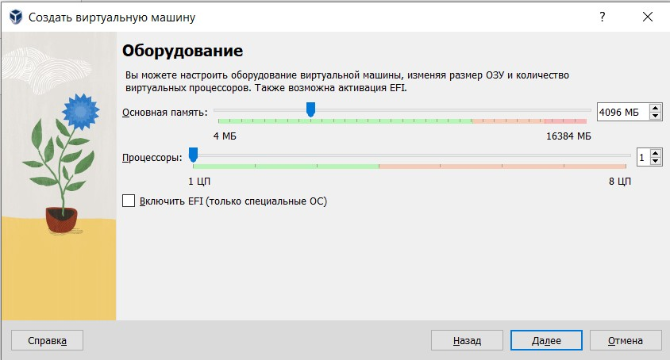{ #fig:002 width=70% }

Создаём новый виртуальный жёсткий диск размером 40 Гб: Cм. [рис. 3](#fig:003)

{ #fig:003 width=70% }

Проверям итоговую конфигурацию для виртуальной машины: Cм. [рис. 4](#fig:004)

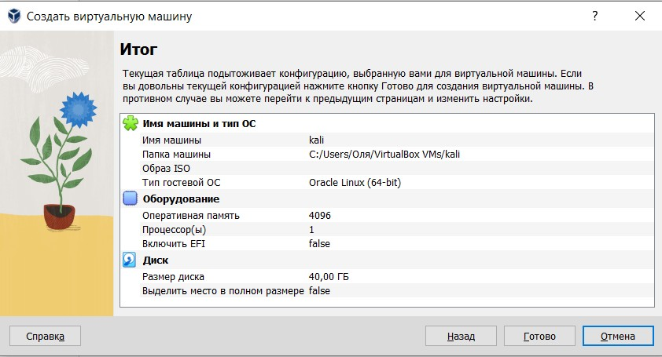{ #fig:004 width=70% }

Меняем контроллер на скаченный образ Rocky: Cм. [рис. 5](#fig:005)

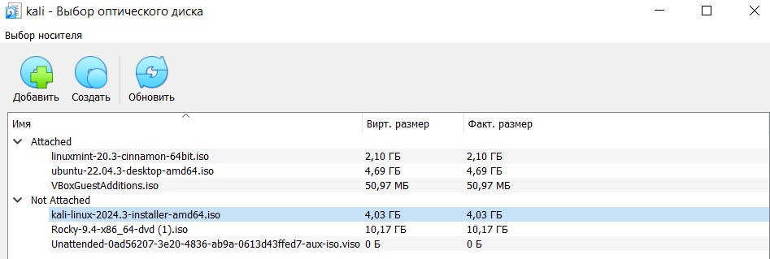{ #fig:005 width=70% }

Приступим к найстройке графики: Cм. [рис. 6](#fig:006)

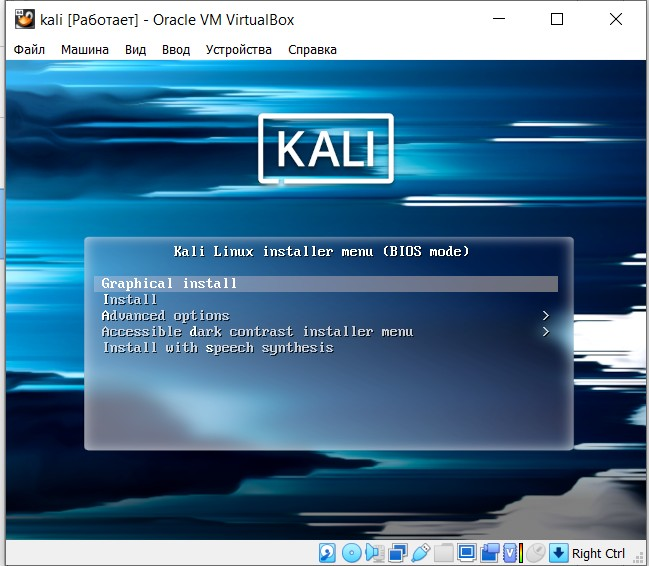{ #fig:006 width=70% }

Попадаем в стартовое меню установки, выбираем русский язык: Cм. [рис. 7](#fig:007), Cм. [рис. 8](#fig:008)

{ #fig:007 width=70% }

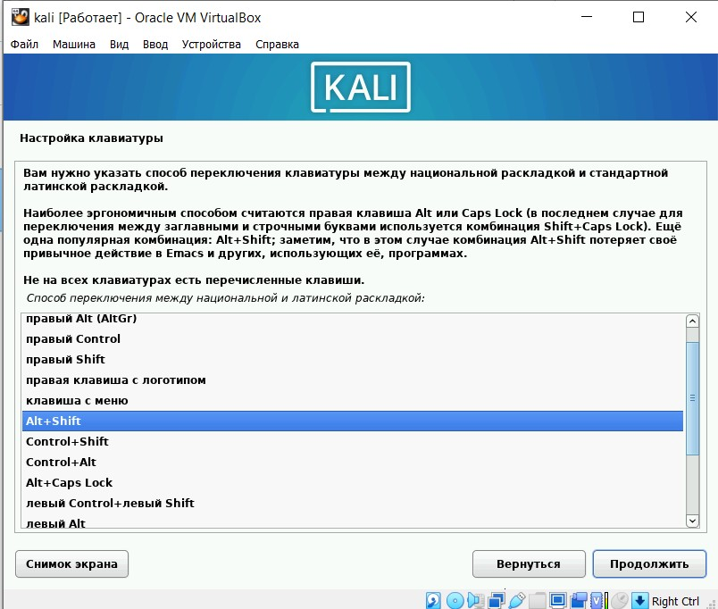{ #fig:008 width=70% }

Вводим имя компьютера: Cм. [рис. 9](#fig:009)

{ #fig:009 width=70% }

Настраиваем имя пользователя: Cм. [рис. 10](#fig:010)

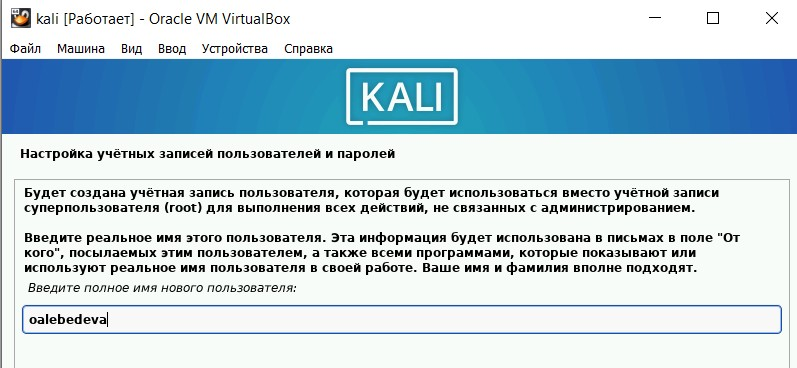{ #fig:010 width=70% }

Настраиваем пароль: Cм. [рис. 11](#fig:011)

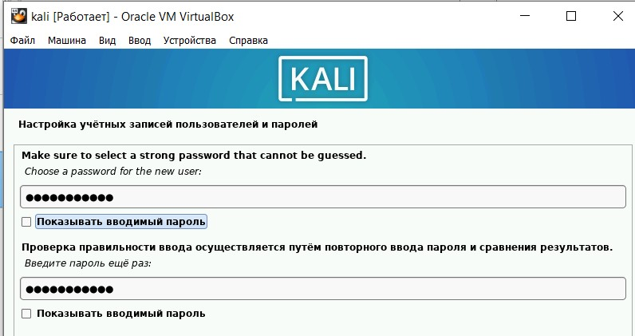{ #fig:011 width=70% }

Выбираем разметку дисков: Cм. [рис. 12](#fig:012), Cм. [рис. 13](#fig:013), Cм. [рис. 14](#fig:014), Cм. [рис. 15](#fig:015), Cм. [рис. 16](#fig:016)

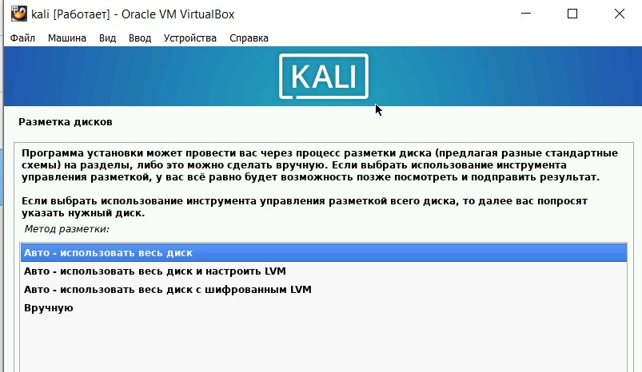{ #fig:012 width=70% }

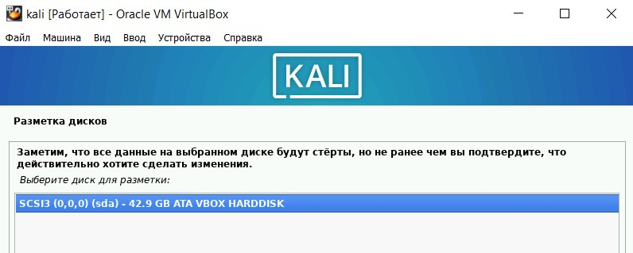{ #fig:013 width=70% }

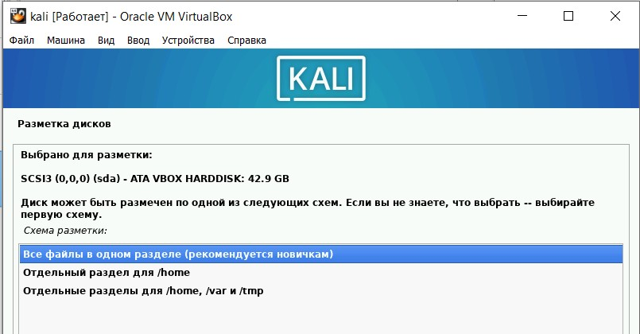{ #fig:014 width=70% }

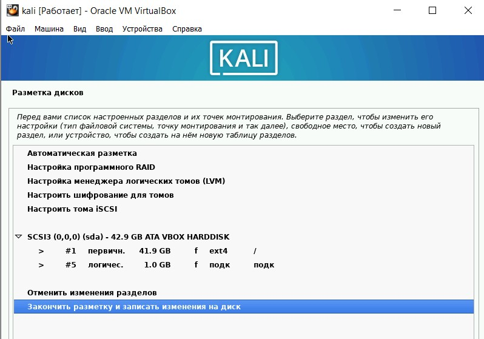{ #fig:015 width=70% }

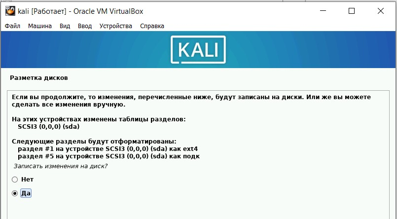{ #fig:016 width=70% }

Запускаем установку базовой системы: Cм. [рис. 17](#fig:017)

{ #fig:017 width=70% }

Выбираем ПО: Cм. [рис. 18](#fig:018)

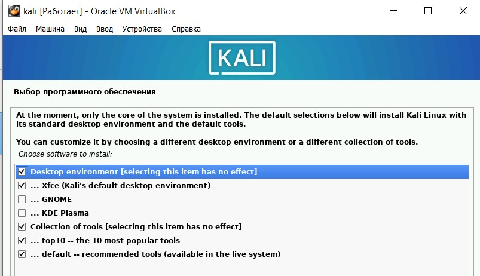{ #fig:018 width=70% }

Запускаем завершение установки: Cм. [рис. 19](#fig:019), Cм. [рис. 20](#fig:020)

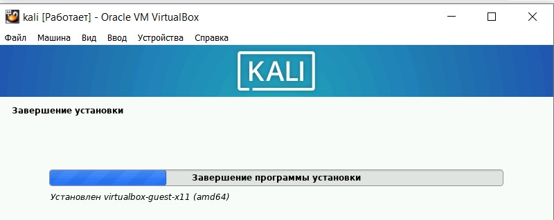{ #fig:019 width=70% }

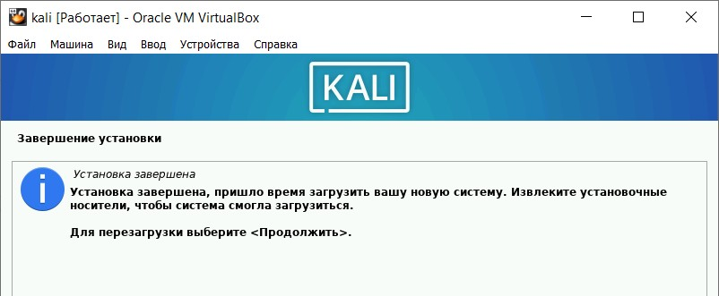{ #fig:020 width=70% }

Заходим в созданную учетную запись: См. [рис. 21](#fig:021)

{ #fig:021 width=70% }

Видим графический интерфейс и на этом завершаем процесс уставки дистрибутива: См. [рис. 22](#fig:022)

{ #fig:022 width=70% }

# Заключение

Установили дистрибутив Kali на виртуальную машину.

# Библиографическая справка 

[1] Документация по VirtualBox: https://www.virtualbox.org/

