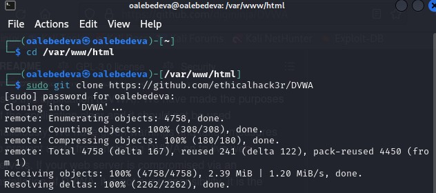
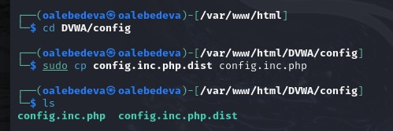
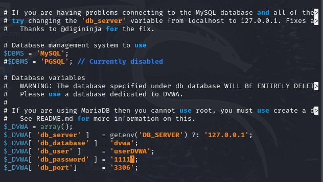
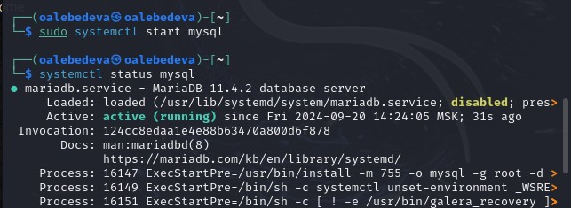
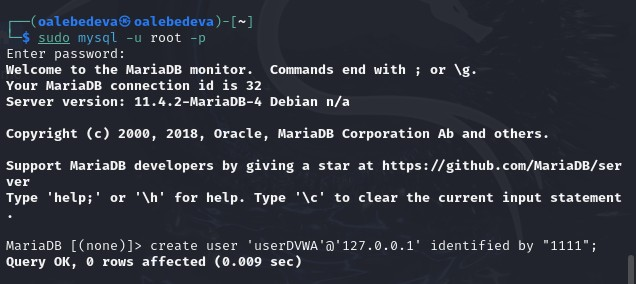
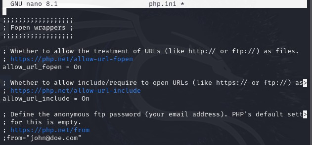
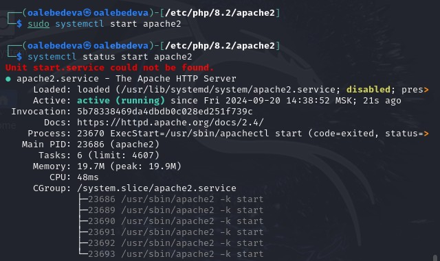
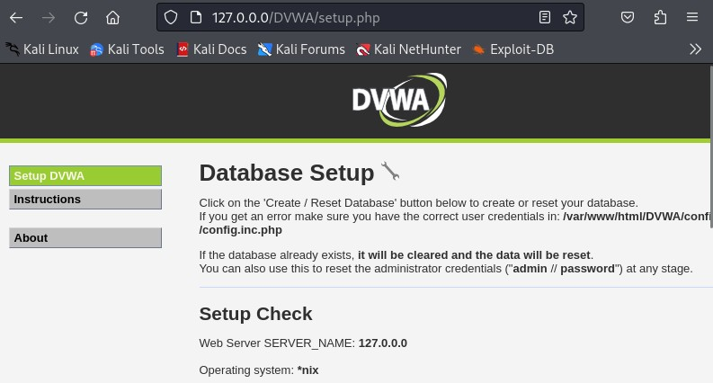
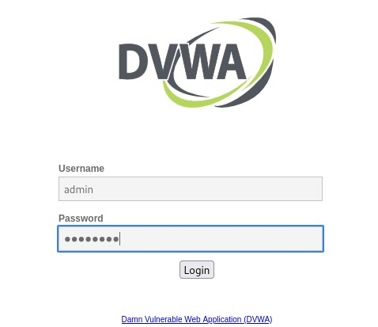
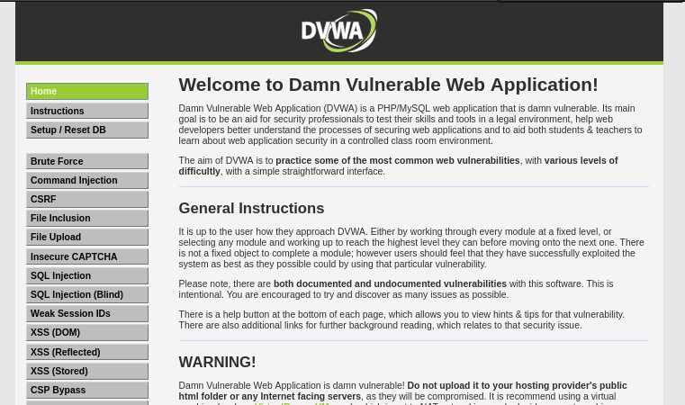

---
## Front matter
lang: ru-RU
title: "Индивидуальный проект. Этап 2. Установка DVWA" 
subtitle: 
author: |
        Выполнила: Лебедева Ольга Андреевна
        \
        Преподаватель Кулябов Дмитрий Сергеевич д.ф.-м.н.,
        \ 
        профессор кафедры прикладной информатики и кибербезопасности
institute: |
           Российский университет дружбы народов, Москва, Россия
date: |
      2024

babel-lang: russian
babel-otherlangs: english
mainfont: Arial
monofont: Courier New
fontsize: 8pt

## Formatting
toc: false
slide_level: 2
theme: metropolis
header-includes: 
 - \metroset{progressbar=frametitle,sectionpage=progressbar,numbering=fraction}
 - '\makeatletter'
 - '\beamer@ignorenonframefalse'
 - '\makeatother'
aspectratio: 43
section-titles: true
---

## Цель работы

Приобретение практических навыков по установке DVWA.

## Теоретическое введение

Damn Vulnerable Web Application (DVWA) – это веб-приложение PHP / MySQL, которое чертовски уязвимо.

Его основная цель – помочь специалистам по безопасности проверить свои навыки и инструменты в правовой среде, помочь веб-разработчикам лучше понять процессы обеспечения безопасности веб-приложений и помочь студентам и преподавателям узнать о безопасности веб-приложений в контролируемой среде[1].

## Выполнение лабораторной работы

Начнём выполнение лабораторной работы c склонирования репозитория по предоставленной ссылке: Cм. [рис. 1](#fig:001)

{ #fig:001 width=70% }

## Выполнение лабораторной работы

Предоставляем все права доступа к папке DVWA: Cм. [рис. 2](#fig:002)

{ #fig:002 width=70% }

## Выполнение лабораторной работы

Создаём копию файла, если вдруг возникнут ошибки в ходе выполнения работы: Cм. [рис. 3](#fig:003)

{ #fig:003 width=70% }  

## Выполнение лабораторной работы

Открываем файл в текстовом редакторе nano: Cм. [рис. 4](#fig:004). 

{ #fig:004 width=70% }

## Выполнение лабораторной работы

Меняем данные об имени пользователя и пароле: Cм. [рис. 5](#fig:005). 

{ #fig:005 width=70% }

## Выполнение лабораторной работы

Проходим авторизацию в базе данных от имени пользователя root. Создаём нового пользователя, при этом пользуемся учетными данными из файла config.inc.php: Cм. [рис. 6](#fig:006).

{ #fig:006 width=70% }

## Выполнение лабораторной работы

Предоставляем все привилегии для работы с базой данных: Cм. [рис. 7](#fig:007).

{ #fig:007 width=70% }

## Выполнение лабораторной работы

В файле параметры allow_url_fopen и allow_url_include должны быть проставлены как On: Cм. [рис. 8](#fig:008).

{ #fig:008 width=70% }

## Выполнение лабораторной работы

Запускаем службу веб-сервера apache и проверяем, была ли служба запущена: Cм. [рис. 9](#fig:009).

{ #fig:009 width=70% }

## Выполнение лабораторной работы

Теперь можем открыть браузер и запустить веб-приложение: Cм. [рис. 10](#fig:010).

{ #fig:010 width=70% }

## Выполнение лабораторной работы

Проходим авторизацию при помощи предложенных по умолчанию данных: Cм. [рис. 11](#fig:011).

{ #fig:011 width=70% }

## Выполнение лабораторной работы

Оказываемся на домашней странице веб-приложения: Cм. [рис. 12](#fig:012).

{ #fig:012 width=70% }

## Заключение

Получили практические навыки по установке DVWA.

## Библиографическая справка 

[1] DVWA: https://itsecforu.ru/2018/02/14/5071/