---
## Front matter
title: "Отчет по индивидуальному проекту"
subtitle: "Этап 2. Установка DVWA"
author: "Лебедева Ольга Андреевна"

## Generic otions
lang: ru-RU
toc-title: "Содержание"

## Bibliography
bibliography: bib/cite.bib
csl: pandoc/csl/gost-r-7-0-5-2008-numeric.csl

## Pdf output format
toc: true # Table of contents
toc-depth: 2
lof: true # List of figures
#lot: true # List of tables
fontsize: 12pt
linestretch: 1.5
papersize: a4
documentclass: scrreprt
## I18n polyglossia
polyglossia-lang:
  name: russian
  options:
    - spelling=modern
    - babelshorthands=true
polyglossia-otherlangs:
  name: english
## I18n babel
babel-lang: russian
babel-otherlangs: english
## Fonts
mainfont: PT Serif
romanfont: PT Serif
sansfont: PT Sans
monofont: PT Mono
mainfontoptions: Ligatures=TeX
romanfontoptions: Ligatures=TeX
sansfontoptions: Ligatures=TeX,Scale=MatchLowercase
monofontoptions: Scale=MatchLowercase,Scale=0.9
## Biblatex
biblatex: true
biblio-style: "gost-numeric"
biblatexoptions:
  - parentracker=true
  - backend=biber
  - hyperref=auto
  - language=auto
  - autolang=other*
  - citestyle=gost-numeric
## Pandoc-crossref LaTeX customization
figureTitle: "Рис."
tableTitle: "Таблица"
listingTitle: "Листинг"
lofTitle: "Список иллюстраций"
lotTitle: "Список таблиц"
lolTitle: "Листинги"
## Misc options
indent: true
header-includes:
  - \usepackage{indentfirst}
  - \usepackage{float} # keep figures where there are in the text
  - \floatplacement{figure}{H} # keep figures where there are in the text
---

# Цель работы

Приобретение практических навыков по установке DVWA.

# Теоретическое введение

Damn Vulnerable Web Application (DVWA) – это веб-приложение PHP / MySQL, которое чертовски уязвимо.

Его основная цель – помочь специалистам по безопасности проверить свои навыки и инструменты в правовой среде, помочь веб-разработчикам лучше понять процессы обеспечения безопасности веб-приложений и помочь студентам и преподавателям узнать о безопасности веб-приложений в контролируемой среде[1].

# Выполнение лабораторной работы

Начнём выполнение лабораторной работы c склонирования репозитория по предоставленной ссылке: Cм. [рис. 1](#fig:001)

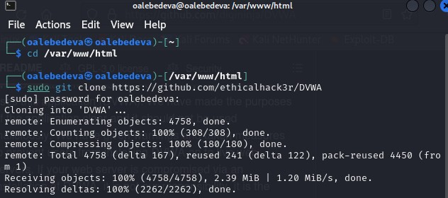{ #fig:001 width=70% }

Предоставляем все права доступа к папке DVWA: Cм. [рис. 2](#fig:002)

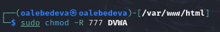{ #fig:002 width=70% }

Создаём копию файла, если вдруг возникнут ошибки в ходе выполнения работы: Cм. [рис. 3](#fig:003)

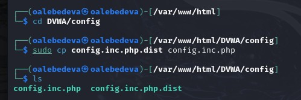{ #fig:003 width=70% }  

Открываем файл в текстовом редакторе nano: Cм. [рис. 4](#fig:004). 

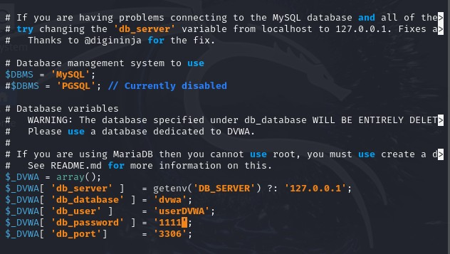{ #fig:004 width=70% }

Меняем данные об имени пользователя и пароле: Cм. [рис. 5](#fig:005). 

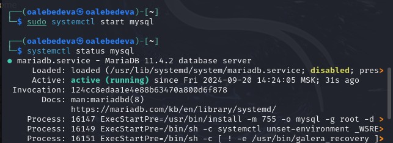{ #fig:005 width=70% }

Проходим авторизацию в базе данных от имени пользователя root. Создаём нового пользователя, при этом пользуемся учетными данными из файла config.inc.php: Cм. [рис. 6](#fig:006).

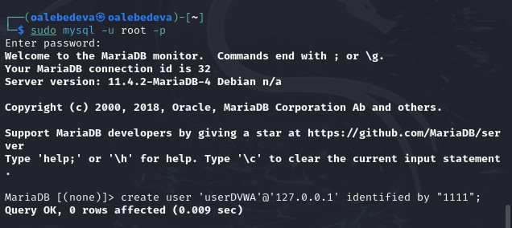{ #fig:006 width=70% }

Предоставляем все привилегии для работы с базой данных: Cм. [рис. 7](#fig:007).

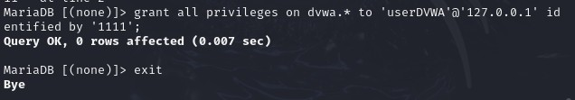{ #fig:007 width=70% }

В файле параметры allow_url_fopen и allow_url_include должны быть проставлены как On: Cм. [рис. 8](#fig:008).

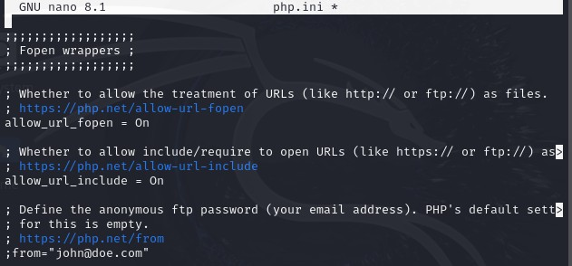{ #fig:008 width=70% }

Запускаем службу веб-сервера apache и проверяем, была ли служба запущена: Cм. [рис. 9](#fig:009).

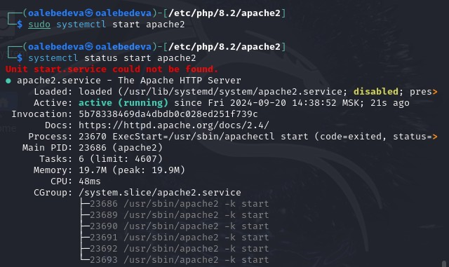{ #fig:009 width=70% }

Теперь можем открыть браузер и запустить веб-приложение: Cм. [рис. 10](#fig:010).

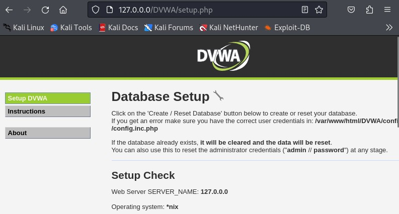{ #fig:010 width=70% }

Проходим авторизацию при помощи предложенных по умолчанию данных: Cм. [рис. 11](#fig:011).

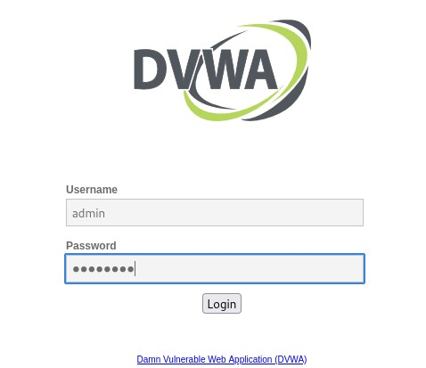{ #fig:011 width=70% }

Оказываемся на домашней странице веб-приложения: Cм. [рис. 12](#fig:012).

{ #fig:012 width=70% }

# Заключение

Получили практические навыки по установке DVWA.

# Библиографическая справка 

[1] DVWA: https://itsecforu.ru/2018/02/14/5071/