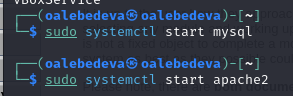
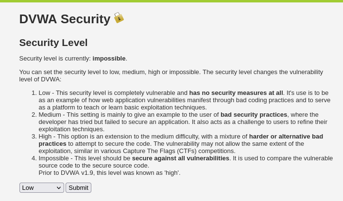
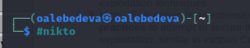
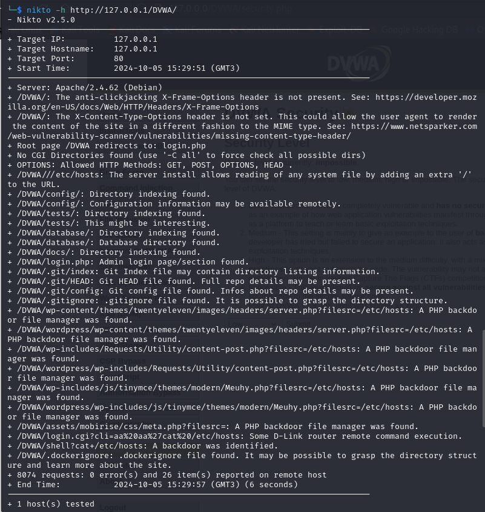
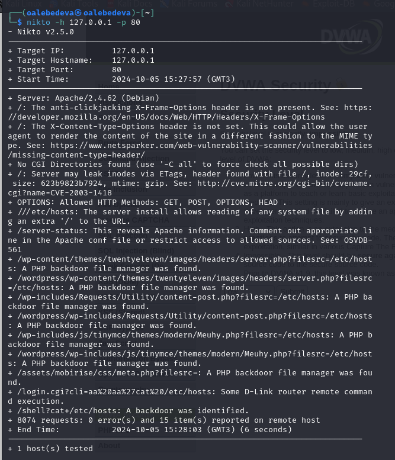

---
## Front matter
lang: ru-RU
title: "Индивидуальный проект. Этап 4. Nikto" 
subtitle: 
author: |
        Выполнила: Лебедева Ольга Андреевна
        \
        Преподаватель Кулябов Дмитрий Сергеевич д.ф.-м.н.,
        \ 
        профессор кафедры прикладной информатики и кибербезопасности
institute: |
           Российский университет дружбы народов, Москва, Россия
date: |
      2024

babel-lang: russian
babel-otherlangs: english
mainfont: Arial
monofont: Courier New
fontsize: 8pt

## Formatting
toc: false
slide_level: 2
theme: metropolis
header-includes: 
 - \metroset{progressbar=frametitle,sectionpage=progressbar,numbering=fraction}
 - '\makeatletter'
 - '\beamer@ignorenonframefalse'
 - '\makeatother'
aspectratio: 43
section-titles: true
---

## Цель работы

Научиться тестированию веб-приложений при помощи сканера hikto.

## Теоретическое введение

nikto — базовый сканер безопасности веб-сервера. Он сканирует и обнаруживает уязвимости в веб-приложениях, обычно вызванные неправильной конфигурацией на самом сервере, файлами, установленными по умолчанию, и небезопасными файлами, а также устаревшими серверными приложениями. Поскольку nikto построен исключительно на LibWhisker2, он сразу после установки поддерживает кросс-платформенное развертывание, SSL (криптографический протокол, который подразумевает более безопасную связь), методы аутентификации хоста (NTLM/Basic), прокси и несколько методов уклонения от идентификаторов. Он также поддерживает перечисление поддоменов, проверку безопасности приложений (XSS, SQL-инъекции и т. д.) и способен с помощью атаки паролей на основе словаря угадывать учетные данные авторизации.

Сканер nikto позволяет идентифицировать уязвимости веб-приложений, такие как раскрытие информации, инъекция (XSS/Script/HTML), удаленный поиск файлов (на уровне сервера), выполнение команд и идентификация программного обеспечения. В дополнение к показанному ранее основному сканированию nikto позволяет испытателю на проникновение настроить сканирование конкретной цели. Рассмотрим параметры, которые следует использовать при сканировании[1].

## Выполнение лабораторной работы

Чтобы работать с nikto, нам необходимо подготовить веб-приложение, которое мы будем сканировать. Пусть это будет DVWA. Для этого запускаем apache2: Cм. [рис. 1](#fig:001)

{ #fig:001 width=70% }

## Выполнение лабораторной работы

Вводим в адресной строке браузера адрес DVWA, переходим в режим выбора уровня безопасности, ставим, например, low: Cм. [рис. 2](#fig:002)

{ #fig:002 width=70% }

## Выполнение лабораторной работы

Теперь запускаем nikto: Cм. [рис. 3](#fig:003)

{ #fig:003 width=70% }

## Выполнение лабораторной работы

Проверить веб-приложение можно, введя его полный URL: Cм. [рис. 4](#fig:004). 

{ #fig:004 width=70% }

## Выполнение лабораторной работы

Можно еще просканировать, введя адрес хоста и адрес порта, результаты будут незначительно отличаться: Cм. [рис. 5](#fig:005). 

{ #fig:005 width=70% }

## Анализ результатов

Кроме адреса хоста и порта веб-приложения, nikto выводит инофрмацию о различных уязвимостях приложения:

Сервер: Apache/2.4.58 (Debian)

/DVWA/: Заголовок X-Frame-Options, защищающий от перехвата кликов, отсутствует. Смотрите: https://developer.mozilla.org/en-US/docs/Web/HTTP/Headers/X-Frame-Options

/DVWA/: Заголовок X-Content-Type-Options не задан. Это может позволить пользовательскому агенту отображать содержимое сайта способом, отличным от MIME-типа. Смотрите: https://www.netsparker.com/web-vulnerability-scanner/vulnerabilities/missing-content-type-header/

Корневая страница /DVWA перенаправляет на: login.php

## Анализ результатов

Каталоги CGI не найдены (используйте '-C all', чтобы принудительно проверить все возможные каталоги)

ОПЦИИ: Разрешенные HTTP-методы: GET, POST, OPTIONS, HEAD .

/DVWA///etc/hosts: Установка сервера позволяет считывать любой системный файл, добавляя дополнительный "/" к URL-адресу.

/DVWA/config/: Найдена индексация каталога.

/DVWA/config/: Информация о конфигурации может быть доступна удаленно.

## Анализ результатов

/DVWA/tests/: Найдена индексация каталога.

/DVWA/tests/: Это может быть интересно.

/DVWA/database/: Найдена индексация каталога.

/DVWA/база данных/: Найден каталог базы данных.

/DVWA/документы/: Найдена индексация каталога.

/DVWA/login.php: Найдена страница входа администратора/раздел.

## Анализ результатов

/DVWA/.git/index: Индексный файл Git может содержать информацию о списке каталогов.

/DVWA/.git/HEAD: Найден файл Git HEAD. Может содержаться полная информация о репозитории.

/DVWA/.git/config: Найден конфигурационный файл Git. Может содержаться информация о деталях репозитория.

/DVWA/.gitignore: найден файл .gitignore. Можно разобраться в структуре каталогов.

/DVWA/wp-content/themes/twentyeleven/images/headers/server.php?filesrc=/etc/hosts: Обнаружен файловый менеджер с бэкдором на PHP.

## Анализ результатов

/DVWA/wordpress/wp-content/themes/twentyeleven/images/headers/server.php?filesrc=/etc/hosts: Обнаружен файловый менеджер с бэкдором на PHP.

/DVWA/wp-includes/Requests/Utility/content-post.php?filesrc=/etc/hosts: Найден файловый менеджер с бэкдором на PHP.

/DVWA/wordpress/wp-includes/Requests/Utility/content-post.php?filesrc=/etc/hosts: Найден файловый менеджер с бэкдором на PHP.

/DVWA/wp-включает в себя/js/tinymce/themes/modern/Meuhy.php?filesrc=/etc/hosts: Найден файловый менеджер бэкдора PHP.

## Анализ результатов

/DVWA/wordpress/wp-включает в себя/js/tinymce/themes/modern/Meuhy.php?filesrc=/etc/hosts: Найден файловый менеджер бэкдора на PHP.

/DVWA/assets/mobirise/css/meta.php?filesrc=: Найден файловый менеджер бэкдора на PHP.

/DVWA/login.cgi?cli=aa%20aa%27cat%20/etc/hosts: Удаленное выполнение какой-либо команды маршрутизатором D-Link.

/DVWA/shell?cat+/etc/hosts: Обнаружен черный ход.

/DVWA/.dockerignore: найден файл .dockerignore. Возможно, удастся разобраться в структуре каталогов и узнать больше о сайте.

## Анализ результатов

Бэкдор, тайный вход (от англ. back door — «чёрный ход», «лазейка», буквально «задняя дверь») — дефект алгоритма, который намеренно встраивается в него разработчиком и позволяет получить несанкционированный доступ к данным или удалённому управлению операционной системой и компьютером в целом.

Также в результатах nikto отображает код OSVDB 561 и дает ссылку на CVE-2003-1418. OSVDB — это аббревиатура базы данных уязвимостей с открытым исходным кодом.

## Анализ результатов

CVE-2003-1418 — это уязвимость в Apache HTTP Server 1.3.22–1.3.27 на OpenBSD, которая позволяет удалённым злоумышленникам получать конфиденциальную информацию через:

Заголовок ETag, который раскрывает номер вode.

Многочастную границу MIME, которая раскрывает идентификаторы дочерних процессов (PID).

В настоящее время эта проблема имеет среднюю степень тяжести.

## Заключение

Научились тестировать веб-приложения при помощи сканера hikto.

## Библиографическая справка 

[1] Nikto: https://habr.com/ru/companies/first/articles/731696/