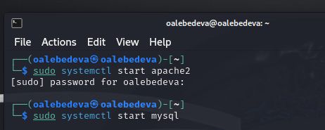
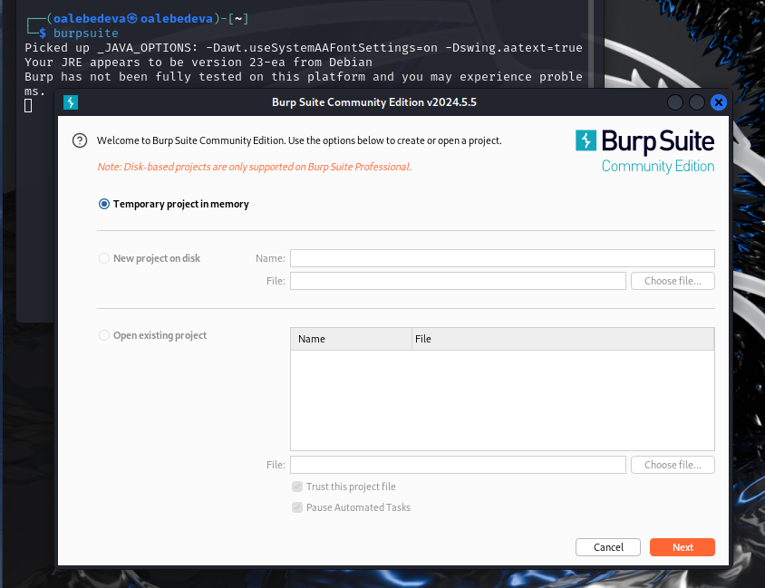
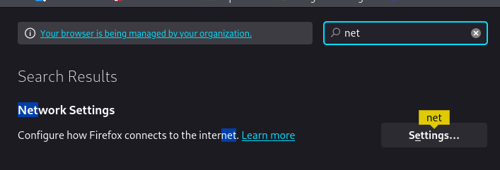
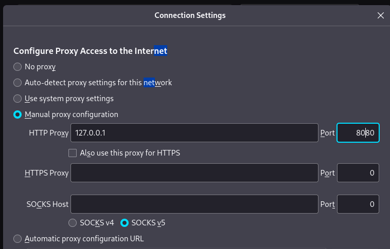
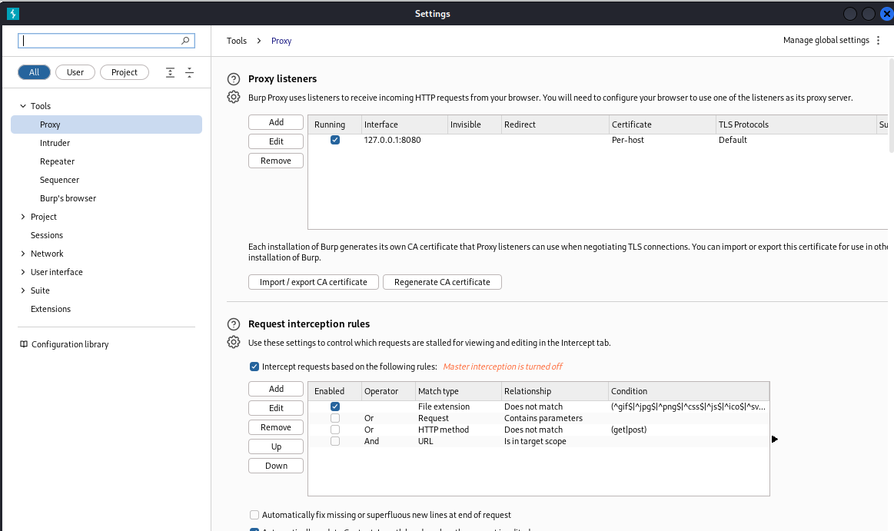
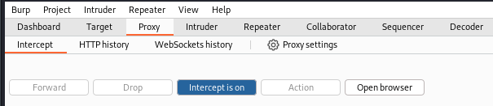
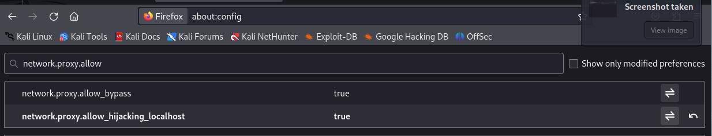
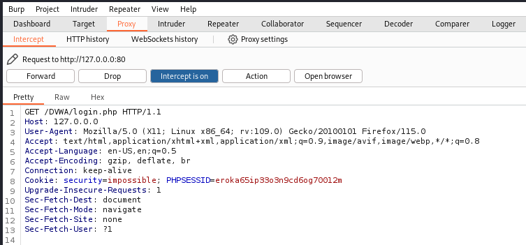
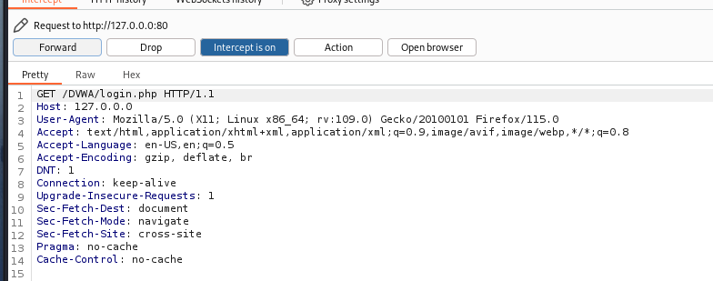
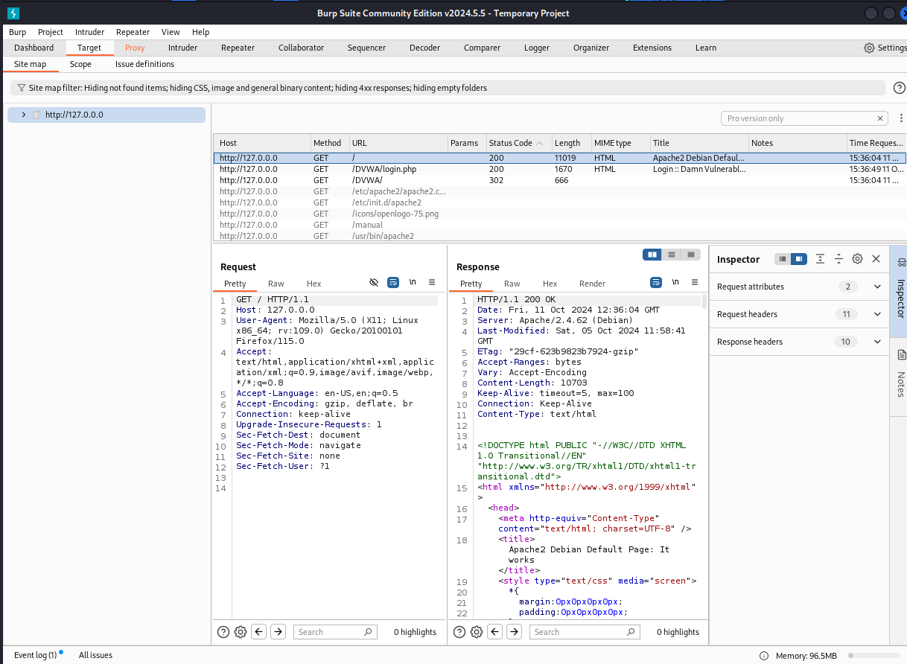

---
## Front matter
lang: ru-RU
title: "Индивидуальный проект. Этап 5. Burp Suite" 
subtitle: 
author: |
        Выполнила: Лебедева Ольга Андреевна
        \
        Преподаватель Кулябов Дмитрий Сергеевич д.ф.-м.н.,
        \ 
        профессор кафедры прикладной информатики и кибербезопасности
institute: |
           Российский университет дружбы народов, Москва, Россия
date: |
      2024

babel-lang: russian
babel-otherlangs: english
mainfont: Arial
monofont: Courier New
fontsize: 8pt

## Formatting
toc: false
slide_level: 2
theme: metropolis
header-includes: 
 - \metroset{progressbar=frametitle,sectionpage=progressbar,numbering=fraction}
 - '\makeatletter'
 - '\beamer@ignorenonframefalse'
 - '\makeatother'
aspectratio: 43
section-titles: true
---

## Цель работы

Научиться использовать Burp Suite.

## Теоретическое введение

Burp Suite — это набор инструментов для проведения аудита безопасности веб-приложений. Он позволяет анализировать трафик между клиентом и сервером, обнаруживать уязвимости в приложениях и автоматически создавать эксплойты для их использования. Burp Suite также может использоваться для тестирования на проникновение и мониторинга безопасности сетей[1].

## Выполнение лабораторной работы

Подготовим открытие приложения DVWA. Для этого запустим локальный сервер: Cм. [рис. 1](#fig:001)

{ #fig:001 width=70% }

## Выполнение лабораторной работы

Через консоль запускаем инструмент Burp Suite: Cм. [рис. 2](#fig:002)

{ #fig:002 width=70% }

## Выполнение лабораторной работы

Заходим в настройки браузера в раздел netwirk settings: Cм. [рис. 3](#fig:003)

{ #fig:003 width=70% }

## Выполнение лабораторной работы

Меняем настройки сервера для возможности работы с proxy и захватом данных при помощи Burp Suite: Cм. [рис. 4](#fig:004)

{ #fig:004 width=70% }

## Выполнение лабораторной работы

Заходим в раздел settings в Burp Suite и настраиваем параметры: Cм. [рис. 5](#fig:005)

{ #fig:005 width=70% }

## Выполнение лабораторной работы

Для последующей работы изменяем настройки в разделе proxy. Ставим "intercept is on": Cм. [рис. 6](#fig:006)

{ #fig:006 width=70% }

## Выполнение лабораторной работы

В настройках браузера необходимо установить параметр network.proxy.allow_hijacking_localhost на значение true: Cм. [рис. 7](#fig:007) 

{ #fig:007 width=70% }

## Выполнение лабораторной работы

Пробуем зайти на сайт DVWA, и нас сразу перенаправляет в приложение Burp Suite: Cм. [рис. 8](#fig:008)

{ #fig:008 width=70% }

## Выполнение лабораторной работы

Нажимаем клавишу forward, и скрипт запроса в разделе proxy меняется. Теперь загружается и страница авторизации: Cм. [рис. 9](#fig:009)

{ #fig:009 width=70% }

## Выполнение лабораторной работы

Переходим во вкладку target, там мы можем увидеть историю запросов: Cм. [рис. 10](#fig:010)

{ #fig:010 width=70% }

## Заключение

Приобрели навыки использования набора инструментов Burp Suite.

## Библиографическая справка 

[1] Burp Suite: https://ru.hexlet.io/qna/glossary/questions/chto-takoe-burp-suite

