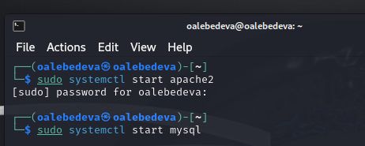
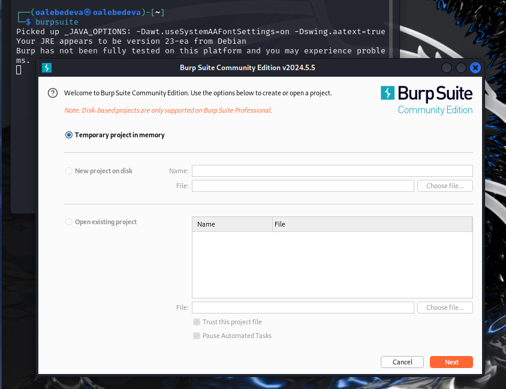
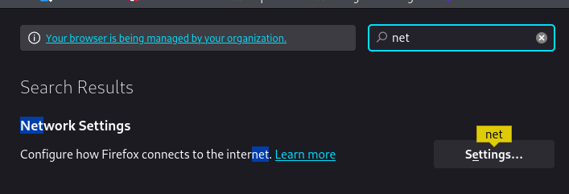
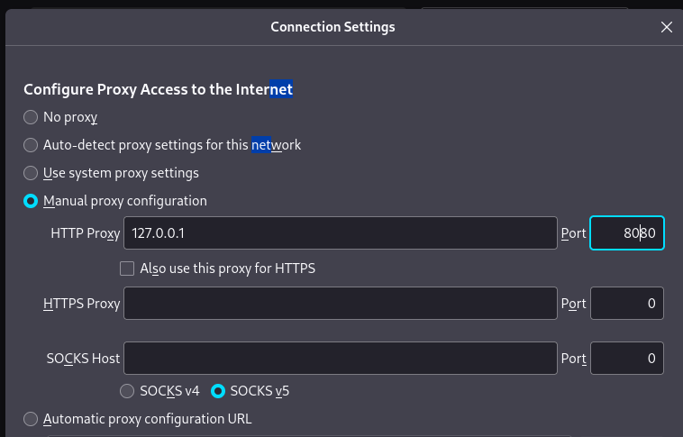
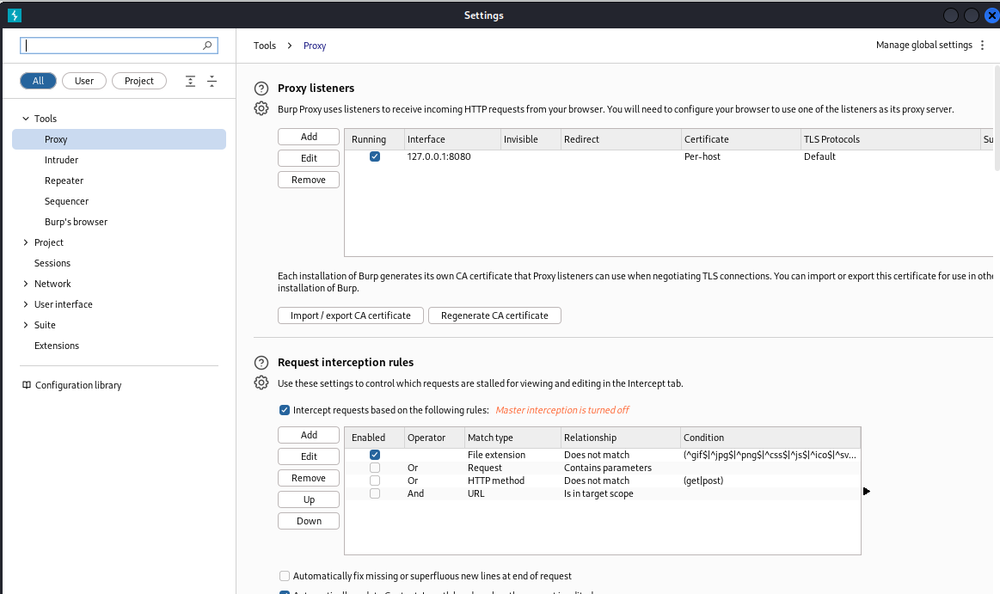
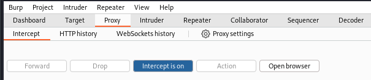
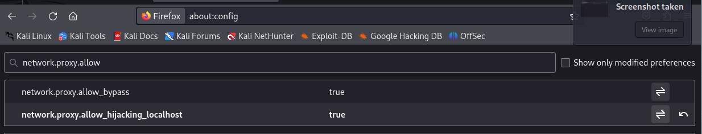
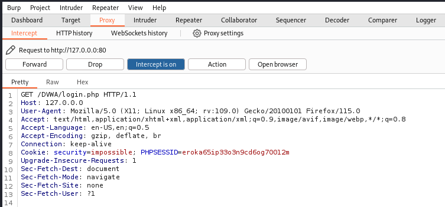
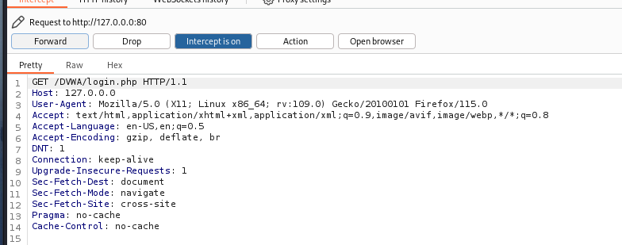
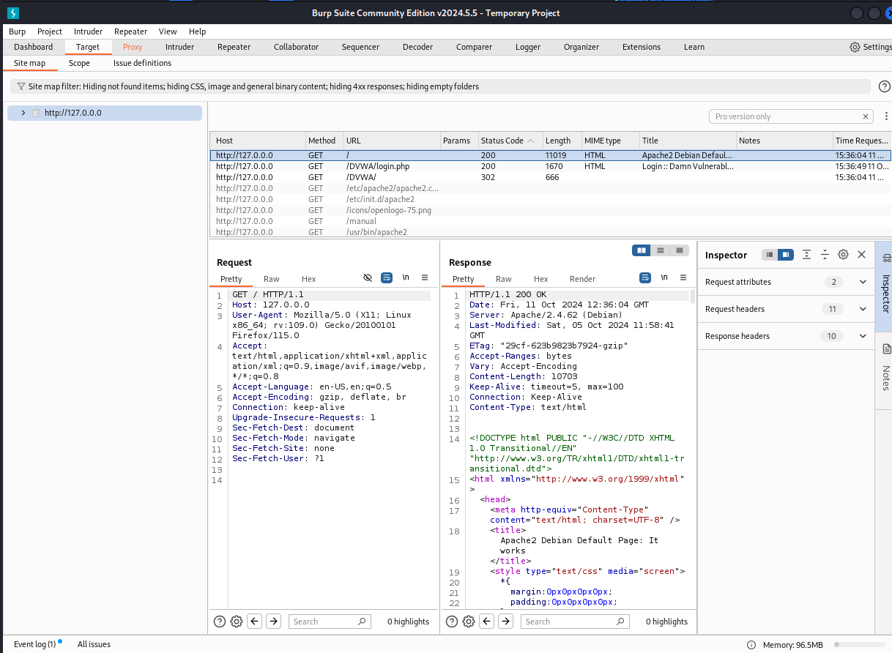

---
## Front matter
title: "Индивидуальный проект. Этап 5"
subtitle: "Использование Burp Suite"
author: "Лебедева Ольга Андреевна"

## Generic otions
lang: ru-RU
toc-title: "Содержание"

## Bibliography
bibliography: bib/cite.bib
csl: pandoc/csl/gost-r-7-0-5-2008-numeric.csl

## Pdf output format
toc: true # Table of contents
toc-depth: 2
lof: true # List of figures
#lot: true # List of tables
fontsize: 12pt
linestretch: 1.5
papersize: a4
documentclass: scrreprt
## I18n polyglossia
polyglossia-lang:
  name: russian
  options:
    - spelling=modern
    - babelshorthands=true
polyglossia-otherlangs:
  name: english
## I18n babel
babel-lang: russian
babel-otherlangs: english
## Fonts
mainfont: PT Serif
romanfont: PT Serif
sansfont: PT Sans
monofont: PT Mono
mainfontoptions: Ligatures=TeX
romanfontoptions: Ligatures=TeX
sansfontoptions: Ligatures=TeX,Scale=MatchLowercase
monofontoptions: Scale=MatchLowercase,Scale=0.9
## Biblatex
biblatex: true
biblio-style: "gost-numeric"
biblatexoptions:
  - parentracker=true
  - backend=biber
  - hyperref=auto
  - language=auto
  - autolang=other*
  - citestyle=gost-numeric
## Pandoc-crossref LaTeX customization
figureTitle: "Рис."
tableTitle: "Таблица"
listingTitle: "Листинг"
lofTitle: "Список иллюстраций"
lotTitle: "Список таблиц"
lolTitle: "Листинги"
## Misc options
indent: true
header-includes:
  - \usepackage{indentfirst}
  - \usepackage{float} # keep figures where there are in the text
  - \floatplacement{figure}{H} # keep figures where there are in the text
---

# Цель работы

Научиться использовать Burp Suite.

# Теоретическое введение

Burp Suite — это набор инструментов для проведения аудита безопасности веб-приложений. Он позволяет анализировать трафик между клиентом и сервером, обнаруживать уязвимости в приложениях и автоматически создавать эксплойты для их использования. Burp Suite также может использоваться для тестирования на проникновение и мониторинга безопасности сетей[1].

# Выполнение лабораторной работы

Подготовим открытие приложения DVWA. Для этого запустим локальный сервер: Cм. [рис. 1](#fig:001)

{ #fig:001 width=70% }

Через консоль запускаем инструмент Burp Suite: Cм. [рис. 2](#fig:002)

{ #fig:002 width=70% }

Заходим в настройки браузера в раздел netwirk settings: Cм. [рис. 3](#fig:003)

{ #fig:003 width=70% }

Меняем настройки сервера для возможности работы с proxy и захватом данных при помощи Burp Suite: Cм. [рис. 4](#fig:004)

{ #fig:004 width=70% }

Заходим в раздел settings в Burp Suite и настраиваем параметры: Cм. [рис. 5](#fig:005)

{ #fig:005 width=70% }

Для последующей работы изменяем настройки в разделе proxy. Ставим "intercept is on": Cм. [рис. 6](#fig:006)

{ #fig:006 width=70% }

В настройках браузера необходимо установить параметр network.proxy.allow_hijacking_localhost на значение true: Cм. [рис. 7](#fig:007) 

{ #fig:007 width=70% }

Пробуем зайти на сайт DVWA, и нас сразу перенаправляет в приложение Burp Suite: Cм. [рис. 8](#fig:008)

{ #fig:008 width=70% }

Нажимаем клавишу forward, и скрипт запроса в разделе proxy меняется. Теперь загружается и страница авторизации: Cм. [рис. 9](#fig:009)

{ #fig:009 width=70% }

Переходим во вкладку target, там мы можем увидеть историю запросов: Cм. [рис. 10](#fig:010)

{ #fig:010 width=70% }

# Заключение

Приобрели навыки использования набора инструментов Burp Suite.

# Библиографическая справка 

[1] Burp Suite: https://ru.hexlet.io/qna/glossary/questions/chto-takoe-burp-suite

